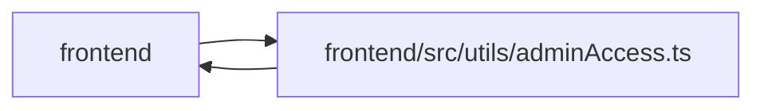

# adminAccess Module

**Path:** `frontend/src/utils/adminAccess.ts`

## Description

_Auto-generated from `frontend/src/utils/adminAccess.ts`._

## Imports

| Source | Symbols |
|--------|---------|
| `./apiError` | `getApiErrorMessage`, `getApiErrorStatus` |

## Module Signals

| Signal | Values |
|--------|--------|
| Exports | `ADMIN_API_KEY_CHANGED_EVENT`, `ADMIN_API_KEY_STORAGE_KEY`, `AdminAccessErrorMessages`, `clearAdminApiKey`, `getAdminAccessErrorMessage`, `getAdminApiKey`, `hasAdminApiKey`, `setAdminApiKey` |
| Constants | `ADMIN_API_KEY_STORAGE_KEY`, `ADMIN_API_KEY_CHANGED_EVENT` |

## Local dependency map

<!-- Auto-generated local dependency summary. Do not edit by hand. -->

> Module-level dependencies exceed the generated-diagram limits, so the diagram and table below group them by top-level package. Counts report the number of module neighbors in each package.

### Internal neighbors

| Direction | Module |
|---|---|
| Inbound | `frontend` (11) |
| Outbound | `frontend` (1) |

> All 12 module neighbor(s) are summarized by package because the module-level view exceeds the 12-node limit.

## Classes

| Class | Kind | Line | Bases / Target | Description |
|-------|------|------|----------------|-------------|
| [AdminAccessErrorMessages](../entities/AdminAccessErrorMessages.md) | Class | 6 | — | — |

## Functions

| Function | Signature | Decorators | Description |
|----------|-----------|------------|-------------|
| `getAdminApiKey` | `()` | — | — |
| `hasAdminApiKey` | `()` | — | — |
| `setAdminApiKey` | `(apiKey: string)` | — | — |
| `clearAdminApiKey` | `()` | — | — |
| `getAdminAccessErrorMessage` | `(error: unknown, messages: AdminAccessErrorMessages)` | — | — |
