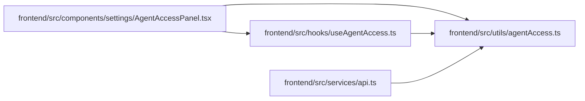

# agentAccess Module

**Path:** `frontend/src/utils/agentAccess.ts`

## Description

_Auto-generated from `frontend/src/utils/agentAccess.ts`._

## Module Signals

| Signal | Values |
|--------|--------|
| Exports | `AGENT_API_KEY_CHANGED_EVENT`, `AGENT_API_KEY_STORAGE_KEY`, `clearAgentApiKey`, `getAgentApiKey`, `hasAgentApiKey`, `setAgentApiKey` |
| Constants | `AGENT_API_KEY_STORAGE_KEY`, `AGENT_API_KEY_CHANGED_EVENT` |

## Local dependency map

<!-- Auto-generated local dependency summary. Do not edit by hand. -->

### Internal neighbors

| Direction | Module |
|---|---|
| Inbound | [AgentAccessPanel](../modules/AgentAccessPanel.md) |
| Inbound | [useAgentAccess](../modules/useAgentAccess.md) |
| Inbound | [api](../modules/api.md) |

## Functions

| Function | Signature | Decorators | Description |
|----------|-----------|------------|-------------|
| `getAgentApiKey` | `()` | — | — |
| `hasAgentApiKey` | `()` | — | — |
| `setAgentApiKey` | `(apiKey: string)` | — | — |
| `clearAgentApiKey` | `()` | — | — |
