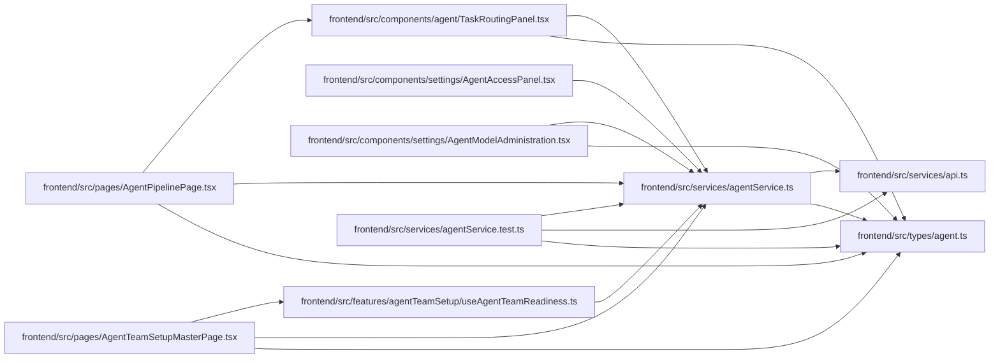

# agentService Module

**Path:** `frontend/src/services/agentService.ts`

## Description

_Auto-generated from `frontend/src/services/agentService.ts`._

## Imports

| Source | Symbols |
|--------|---------|
| `../types/agent` | `AgentActorRosterItem`, `AgentAssignmentListParams`, `AgentCapabilities`, `AgentCommandMetadata`, `AgentModelBinding`, `AgentModelBindingCreate`, `AgentModelBindingDisable`, `AgentModelBindingListParams`, `AgentModelBindingUpdate`, `AgentModelCatalogCreate`, `AgentModelCatalogDisable`, `AgentModelCatalogEntry`, `AgentModelCatalogUpdate`, `AgentModelMutationReceipt`, `AgentPipeline`, `AgentProfileSkillCatalogItem`, `AgentRoutingPreviewCreate`, `AgentRoutingPreviewResponse`, `AgentRun`, `AgentTaskAssignment`, `AgentTeamApplyResponse`, `AgentTeamMaster`, `AgentTeamPlan`, `AgentTeamStatus`, `AgentTeamValidation`, `ModelAwareAgentTaskAssignmentCreate`, `ModelAwareAgentTaskAssignmentUpdate`, `TaskRoutingAssessmentCommand`, `TaskRoutingAssessmentHistory`, `TaskRoutingAssessmentMutationReceipt`, `TaskRoutingAssessmentState`, `TaskTimelineResponse` |
| `./api` | `api` |

## Module Signals

| Signal | Values |
|--------|--------|
| Exports | `agentService` |
| Constants | `agentService` |

## Local dependency map

<!-- Auto-generated local dependency summary. Do not edit by hand. -->

### Internal neighbors

| Direction | Module |
|---|---|
| Inbound | [TaskRoutingPanel](../modules/TaskRoutingPanel.md) |
| Inbound | [AgentAccessPanel](../modules/AgentAccessPanel.md) |
| Inbound | [AgentModelAdministration](../modules/AgentModelAdministration.md) |
| Inbound | [useAgentTeamReadiness](../modules/useAgentTeamReadiness.md) |
| Inbound | [AgentPipelinePage](../modules/AgentPipelinePage.md) |
| Inbound | [AgentTeamSetupMasterPage](../modules/AgentTeamSetupMasterPage.md) |
| Inbound | [agentService.test](../modules/agentService.test.md) |
| Outbound | [api](../modules/api.md) |
| Outbound | [types_agent](../modules/types_agent.md) |
