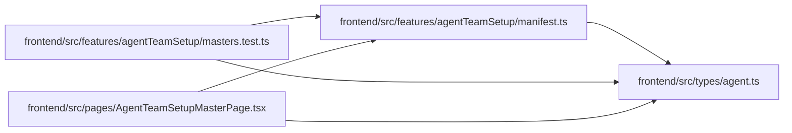

# manifest Module

**Path:** `frontend/src/features/agentTeamSetup/manifest.ts`

## Description

_Auto-generated from `frontend/src/features/agentTeamSetup/manifest.ts`._

## Imports

| Source | Symbols |
|--------|---------|
| `../../types/agent` | `AgentTeamMaster` |

## Module Signals

| Signal | Values |
|--------|--------|
| Exports | `assertAgentTeamMasterSecretFree`, `parseAgentTeamMasterEditor` |
| Constants | `SECRET_FIELDS`, `SECRET_VALUE_PATTERNS` |
| Module calls | `SECRET_FIELDS = Set` |

## Local dependency map

<!-- Auto-generated local dependency summary. Do not edit by hand. -->

### Internal neighbors

| Direction | Module |
|---|---|
| Inbound | [agentTeamSetup_masters.test](../modules/agentTeamSetup_masters.test.md) |
| Inbound | [AgentTeamSetupMasterPage](../modules/AgentTeamSetupMasterPage.md) |
| Outbound | [types_agent](../modules/types_agent.md) |

## Functions

| Function | Signature | Decorators | Description |
|----------|-----------|------------|-------------|
| `assertAgentTeamMasterSecretFree` | `(value: unknown, path = '$') -> void` | — | — |
| `parseAgentTeamMasterEditor` | `(text: string) -> AgentTeamMaster` | — | — |
