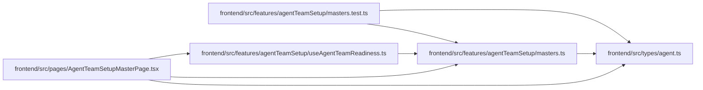

# masters Module

**Path:** `frontend/src/features/agentTeamSetup/masters.ts`

## Description

_Auto-generated from `frontend/src/features/agentTeamSetup/masters.ts`._

## Imports

| Source | Symbols |
|--------|---------|
| `../../types/agent` | `AgentTeamSetupStep`, `AgentTeamStepState` |

## Module Signals

| Signal | Values |
|--------|--------|
| Exports | `AGENT_TEAM_STEP_DEFINITIONS`, `AGENT_TEAM_STEP_IDS`, `AgentTeamStepDefinition`, `AgentTeamStepId`, `stateTone`, `stepProgress`, `stepsById` |
| Constants | `AGENT_TEAM_STEP_IDS`, `AGENT_TEAM_STEP_DEFINITIONS` |
| Module calls | `AGENT_TEAM_STEP_DEFINITIONS = map` |

## Local dependency map

<!-- Auto-generated local dependency summary. Do not edit by hand. -->

### Internal neighbors

| Direction | Module |
|---|---|
| Inbound | [agentTeamSetup_masters.test](../modules/agentTeamSetup_masters.test.md) |
| Inbound | [useAgentTeamReadiness](../modules/useAgentTeamReadiness.md) |
| Inbound | [AgentTeamSetupMasterPage](../modules/AgentTeamSetupMasterPage.md) |
| Outbound | [types_agent](../modules/types_agent.md) |

## Classes

| Class | Kind | Line | Bases / Target | Description |
|-------|------|------|----------------|-------------|
| [AgentTeamStepDefinition](../entities/AgentTeamStepDefinition.md) | Class | 15 | — | — |
| [AgentTeamStepId](../entities/AgentTeamStepId.md) | Type alias | 13 | — | — |

## Functions

| Function | Signature | Decorators | Description |
|----------|-----------|------------|-------------|
| `stepsById` | `(steps: AgentTeamSetupStep[] \| undefined) -> Record<AgentTeamStepId, AgentTeamSetupStep \| undefined>` | — | — |
| `stepProgress` | `(steps: AgentTeamSetupStep[] \| undefined) -> { done: number; total: number } \| null` | — | — |
| `stateTone` | `(state: AgentTeamStepState \| undefined) -> 'done' \| 'warn' \| 'blocked' \| 'todo'` | — | — |
