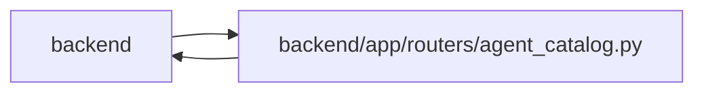

# agent_catalog Module

**Path:** `backend/app/routers/agent_catalog.py`

## Description

Agent capability, profile, and operator-owned model catalog API.

## Imports

| Source | Symbols |
|--------|---------|
| `app.database` | `get_db` |
| `app.models.agent` | `AgentActor` |
| `app.routers.agent` | `get_agent_actor` |
| `app.routers.agent_planning` | `_handle_agent_error`, `get_agent_planning_command_context` |
| `app.schemas.agent_planning` | `AgentPlanningCommandContext` |
| `app.schemas.agent_routing` | `AgentModelBindingCreate`, `AgentModelBindingDisable`, `AgentModelBindingResponse`, `AgentModelBindingUpdate`, `AgentModelCatalogCreate`, `AgentModelCatalogDisable`, `AgentModelCatalogResponse`, `AgentModelCatalogUpdate`, `AgentModelMutationReceipt` |
| `app.schemas.team` | `TeamMemberProfileResponse` |
| `app.services.agent_model_catalog_service` | `AgentModelCatalogService`, `AgentModelConflictError` |
| `app.services.agent_planning_service` | `AgentPlanningService` |
| `app.services.agent_profile_catalog_service` | `AgentProfileCatalogService` |
| `app.services.agent_service` | `actor_has_scope` |
| `fastapi` | `APIRouter`, `Depends`, `HTTPException`, `Query`, `status` |
| `sqlalchemy.ext.asyncio` | `AsyncSession` |
| `typing` | `Annotated`, `Any`, `NoReturn` |

## Local dependency map

<!-- Auto-generated local dependency summary. Do not edit by hand. -->

> Module-level dependencies exceed the generated-diagram limits, so the diagram and table below group them by top-level package. Counts report the number of module neighbors in each package.

### Internal neighbors

| Direction | Module |
|---|---|
| Inbound | `backend` (1) |
| Outbound | `backend` (11) |

### External packages

| Language | Used packages | Undeclared packages |
|---|---:|---:|
| python | 2 | 0 |

> All 12 module neighbor(s) are summarized by package because the module-level view exceeds the 12-node limit.

## Functions

| Function | Signature | Decorators | Description |
|----------|-----------|------------|-------------|
| `get_agent_model_catalog_service` | *(async)* `(db: Annotated[AsyncSession, Depends(get_db, scope='function')]) -> AgentModelCatalogService` | — | Return the request-scoped model control service. |
| `_handle_model_error` | `(exc: Exception) -> NoReturn` | — | Map stable model-control errors without losing conflict context. |
| `_require_catalog_read` | `(actor: AgentActor) -> None` | — | — |
| `get_profile_skill_catalog` | *(async)* `(actor: Annotated[AgentActor, Depends(get_agent_actor)], db: Annotated[AsyncSession, Depends(get_db, scope='function')])` | `@router.get('/agent/profile-skill-catalog', response_model=list[dict[str, Any]])` | Return code-owned advisory capability definitions. |
| `get_agent_profile_presets` | *(async)* `(actor: Annotated[AgentActor, Depends(get_agent_actor)], db: Annotated[AsyncSession, Depends(get_db, scope='function')])` | `@router.get('/agent/profile-presets', response_model=list[dict[str, Any]])` | Return reusable human-reviewable agent profile presets. |
| `get_agent_route_index` | *(async)* `(actor: Annotated[AgentActor, Depends(get_agent_actor)], db: Annotated[AsyncSession, Depends(get_db, scope='function')])` | `@router.get('/agent/routes', response_model=list[dict[str, Any]])` | Return the explainable, non-authorizing agent route index. |
| `apply_agent_profile_preset` | *(async)* `(preset_key: str, actor: Annotated[AgentActor, Depends(get_agent_actor)], db: Annotated[AsyncSession, Depends(get_db, scope='function')], command: Annotated[AgentPlanningCommandContext, Depends(get_agent_planning_command_context)])` | `@router.post('/agent/profile-presets/{preset_key}/apply', response_model=TeamMemberProfileResponse, status_code=status.HTTP_201_CREATED)` | Materialize a preset through an actor-attributed exact command receipt. |
| `list_agent_model_catalog` | *(async)* `(actor: Annotated[AgentActor, Depends(get_agent_actor)], service: Annotated[AgentModelCatalogService, Depends(get_agent_model_catalog_service)], include_disabled: Annotated[bool, Query()] = False)` | `@router.get('/agent/model-catalog', response_model=list[AgentModelCatalogResponse])` | Return bounded secret-free provider-neutral model declarations. |
| `get_agent_model_catalog_entry` | *(async)* `(catalog_key: str, actor: Annotated[AgentActor, Depends(get_agent_actor)], service: Annotated[AgentModelCatalogService, Depends(get_agent_model_catalog_service)])` | `@router.get('/agent/model-catalog/{catalog_key}', response_model=AgentModelCatalogResponse)` | Return one catalog declaration by its stable WorkChord key. |
| `create_agent_model_catalog_entry` | *(async)* `(data: AgentModelCatalogCreate, actor: Annotated[AgentActor, Depends(get_agent_actor)], service: Annotated[AgentModelCatalogService, Depends(get_agent_model_catalog_service)], command: Annotated[AgentPlanningCommandContext, Depends(get_agent_planning_command_context)])` | `@router.post('/agent/model-catalog', response_model=AgentModelMutationReceipt, status_code=status.HTTP_201_CREATED)` | Create a model declaration through a stored admin actor. |
| `update_agent_model_catalog_entry` | *(async)* `(catalog_id: int, data: AgentModelCatalogUpdate, actor: Annotated[AgentActor, Depends(get_agent_actor)], service: Annotated[AgentModelCatalogService, Depends(get_agent_model_catalog_service)], command: Annotated[AgentPlanningCommandContext, Depends(get_agent_planning_command_context)])` | `@router.patch('/agent/model-catalog/{catalog_id}', response_model=AgentModelMutationReceipt)` | Optimistically update a model declaration. |
| `disable_agent_model_catalog_entry` | *(async)* `(catalog_id: int, data: AgentModelCatalogDisable, actor: Annotated[AgentActor, Depends(get_agent_actor)], service: Annotated[AgentModelCatalogService, Depends(get_agent_model_catalog_service)], command: Annotated[AgentPlanningCommandContext, Depends(get_agent_planning_command_context)])` | `@router.post('/agent/model-catalog/{catalog_id}/disable', response_model=AgentModelMutationReceipt)` | Soft-disable a declaration after explicit live-work reconciliation. |
| `list_agent_model_bindings` | *(async)* `(actor: Annotated[AgentActor, Depends(get_agent_actor)], service: Annotated[AgentModelCatalogService, Depends(get_agent_model_catalog_service)], actor_id: Annotated[int \| None, Query(ge=1)] = None, include_disabled: Annotated[bool, Query()] = False)` | `@router.get('/agent/model-bindings', response_model=list[AgentModelBindingResponse])` | Return actor binding evidence without credentials or runtime logs. |
| `get_agent_model_binding` | *(async)* `(binding_id: int, actor: Annotated[AgentActor, Depends(get_agent_actor)], service: Annotated[AgentModelCatalogService, Depends(get_agent_model_catalog_service)])` | `@router.get('/agent/model-bindings/{binding_id}', response_model=AgentModelBindingResponse)` | Return one binding, including disabled historical evidence. |
| `create_agent_model_binding` | *(async)* `(data: AgentModelBindingCreate, actor: Annotated[AgentActor, Depends(get_agent_actor)], service: Annotated[AgentModelCatalogService, Depends(get_agent_model_catalog_service)], command: Annotated[AgentPlanningCommandContext, Depends(get_agent_planning_command_context)])` | `@router.post('/agent/model-bindings', response_model=AgentModelMutationReceipt, status_code=status.HTTP_201_CREATED)` | Bind an existing actor to one existing catalog entry. |
| `update_agent_model_binding` | *(async)* `(binding_id: int, data: AgentModelBindingUpdate, actor: Annotated[AgentActor, Depends(get_agent_actor)], service: Annotated[AgentModelCatalogService, Depends(get_agent_model_catalog_service)], command: Annotated[AgentPlanningCommandContext, Depends(get_agent_planning_command_context)])` | `@router.patch('/agent/model-bindings/{binding_id}', response_model=AgentModelMutationReceipt)` | Optimistically update one actor model binding. |
| `disable_agent_model_binding` | *(async)* `(binding_id: int, data: AgentModelBindingDisable, actor: Annotated[AgentActor, Depends(get_agent_actor)], service: Annotated[AgentModelCatalogService, Depends(get_agent_model_catalog_service)], command: Annotated[AgentPlanningCommandContext, Depends(get_agent_planning_command_context)])` | `@router.post('/agent/model-bindings/{binding_id}/disable', response_model=AgentModelMutationReceipt)` | Soft-disable a binding without deleting assignment or run evidence. |
