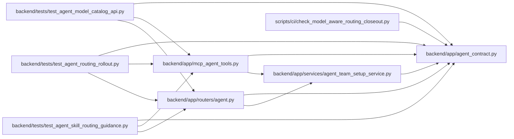

# agent_contract Module

**Path:** `backend/app/agent_contract.py`

## Description

Shared capability handshake contract for REST and MCP projections.

## Imports

| Source | Symbols |
|--------|---------|
| `__future__` | `annotations` |

## Local dependency map

<!-- Auto-generated local dependency summary. Do not edit by hand. -->

### Internal neighbors

| Direction | Module |
|---|---|
| Inbound | [mcp_agent_tools](../modules/mcp_agent_tools.md) |
| Inbound | [routers_agent](../modules/routers_agent.md) |
| Inbound | [agent_team_setup_service](../modules/agent_team_setup_service.md) |
| Inbound | [test_agent_model_catalog_api](../modules/test_agent_model_catalog_api.md) |
| Inbound | [test_agent_routing_rollout](../modules/test_agent_routing_rollout.md) |
| Inbound | [test_agent_skill_routing_guidance](../modules/test_agent_skill_routing_guidance.md) |
| Inbound | [check_model_aware_routing_closeout](../modules/check_model_aware_routing_closeout.md) |

## Functions

| Function | Signature | Decorators | Description |
|----------|-----------|------------|-------------|
| `agent_contract_features` | `(*, include_skill_bundles: bool, model_aware_routing_mode: str = 'off') -> list[str]` | — | Return one ordered feature projection shared by REST and MCP. |
