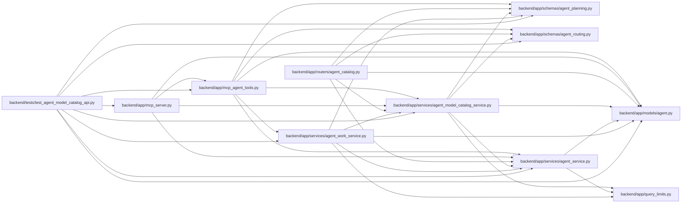

# agent_model_catalog_service Module

**Path:** `backend/app/services/agent_model_catalog_service.py`

## Description

Operator-owned model catalog, binding administration, and audit receipts.

## Imports

| Source | Symbols |
|--------|---------|
| `__future__` | `annotations` |
| `app.models.agent` | `AgentActor`, `AgentIdempotencyRecord`, `AgentModelBinding`, `AgentModelCatalogEntry`, `AgentRun`, `AgentTaskAssignment`, `TaskEvent` |
| `app.query_limits` | `CollectionLimitExceededError`, `MAX_BOUNDED_LIST_ITEMS` |
| `app.schemas.agent_planning` | `AgentPlanningCommandContext` |
| `app.schemas.agent_routing` | `AgentModelBindingCreate`, `AgentModelBindingDisable`, `AgentModelBindingResponse`, `AgentModelBindingUpdate`, `AgentModelCatalogCreate`, `AgentModelCatalogDisable`, `AgentModelCatalogResponse`, `AgentModelCatalogUpdate`, `AgentModelMutationReceipt` |
| `app.services.agent_service` | `AgentConflictError`, `AgentPermissionError`, `actor_has_scope`, `require_scope`, `validate_idempotency_key` |
| `collections.abc` | `Awaitable`, `Callable` |
| `dataclasses` | `dataclass` |
| `hashlib` | `hashlib` |
| `json` | `json` |
| `secrets` | `secrets` |
| `sqlalchemy` | `func`, `select`, `text` |
| `sqlalchemy.exc` | `IntegrityError` |
| `sqlalchemy.ext.asyncio` | `AsyncSession` |
| `sqlalchemy.orm` | `selectinload` |
| `typing` | `Any`, `Literal` |

## Local dependency map

<!-- Auto-generated local dependency summary. Do not edit by hand. -->

### Internal neighbors

| Direction | Module |
|---|---|
| Inbound | [mcp_agent_tools](../modules/mcp_agent_tools.md) |
| Inbound | [mcp_server](../modules/mcp_server.md) |
| Inbound | [agent_catalog](../modules/agent_catalog.md) |
| Inbound | [agent_work_service](../modules/agent_work_service.md) |
| Inbound | [test_agent_model_catalog_api](../modules/test_agent_model_catalog_api.md) |
| Outbound | [models_agent](../modules/models_agent.md) |
| Outbound | [query_limits](../modules/query_limits.md) |
| Outbound | [schemas_agent_planning](../modules/schemas_agent_planning.md) |
| Outbound | [agent_routing](../modules/agent_routing.md) |
| Outbound | [agent_service](../modules/agent_service.md) |

### External packages

| Language | Used packages | Undeclared packages |
|---|---:|---:|
| python | 1 | 0 |

## Classes

| Class | Line | Bases | Description |
|-------|------|-------|-------------|
| [AgentModelConflictError](../entities/AgentModelConflictError.md) | 52 | `AgentConflictError` | Stable model-control conflict shared by REST and MCP. |
| [_MutationResult](../entities/MutationResult.md) | 70 | — | — |
| [AgentModelCatalogService](../entities/AgentModelCatalogService.md) | 82 | — | Expose secret-free reads and replay-safe admin model mutations. |
