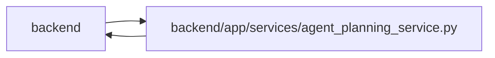

# agent_planning_service Module

**Path:** `backend/app/services/agent_planning_service.py`

## Description

Safe PM setup commands for authenticated agent actors.

The adapter delegates validation and mutation behavior to the existing domain
services, then stores an exact actor-attributed receipt in the same transaction.

Composed planning mutations share one transaction and retain exact durable mutation receipts. Schedule preview has an explicit rollback owner and a transient receipt with original input versions; apply validates the observed task set and input digest. A preview cannot publish snapshots, idempotency records or outbound work.

## Imports

| Source | Symbols |
|--------|---------|
| `app.commands` | `commit_or_flush`, `atomic_command`, `preview_command` |
| `app.models.agent` | `AgentActor`, `AgentIdempotencyRecord` |
| `app.models.calendar` | `Calendar` |
| `app.models.iteration` | `Iteration` |
| `app.models.task` | `Task`, `TaskDependency` |
| `app.models.team_member` | `TeamMember`, `Vacation` |
| `app.schemas.agent` | `AgentTaskCreate`, `AgentTaskPatch` |
| `app.schemas.agent_planning` | `AgentPlanningCommandContext`, `AgentPlanningReceipt`, `AgentScheduleCommand`, `AgentScheduleResult`, `AgentScheduleTaskState` |
| `app.schemas.iteration` | `IterationCreate`, `IterationUpdate` |
| `app.schemas.project` | `ProjectCreate`, `ProjectMilestoneCreateRequest`, `ProjectMilestoneResponse`, `ProjectMilestoneUpdate`, `ProjectResponse`, `ProjectUpdate` |
| `app.schemas.task` | `TaskCreate`, `TaskResponse`, `TaskUpdate` |
| `app.schemas.team` | `TeamMemberCreate`, `TeamMemberProfileCreate`, `TeamMemberProfileResponse`, `TeamMemberProfileUpdate`, `TeamMemberResponse`, `TeamMemberUpdate`, `VacationCreate`, `VacationResponse`, `VacationUpdate` |
| `app.services.agent_profile_catalog_service` | `AgentProfileCatalogService` |
| `app.services.agent_service` | `AgentConflictError`, `require_scope`, `validate_idempotency_key` |
| `app.services.iteration_service` | `IterationService` |
| `app.services.project_service` | `ProjectService` |
| `app.services.scheduler_service` | `SchedulerService` |
| `app.services.task_service` | `TaskService` |
| `app.services.team_service` | `TeamService` |
| `collections.abc` | `Awaitable`, `Callable`, `Mapping` |
| `hashlib` | `hashlib` |
| `json` | `json` |
| `secrets` | `secrets` |
| `sqlalchemy` | `select`, `text` |
| `sqlalchemy.exc` | `IntegrityError` |
| `sqlalchemy.ext.asyncio` | `AsyncSession` |
| `typing` | `Any` |

## Local dependency map

<!-- Auto-generated local dependency summary. Do not edit by hand. -->

> Module-level dependencies exceed the generated-diagram limits, so the diagram and table below group them by top-level package. Counts report the number of module neighbors in each package.

### Internal neighbors

| Direction | Module |
|---|---|
| Inbound | `backend` (5) |
| Outbound | `backend` (19) |

### External packages

| Language | Used packages | Undeclared packages |
|---|---:|---:|
| python | 1 | 0 |

> All 24 module neighbor(s) are summarized by package because the module-level view exceeds the 12-node limit.

## Classes

| Class | Line | Bases | Description |
|-------|------|-------|-------------|
| [_SchedulePreviewComplete](../entities/SchedulePreviewComplete.md) | 70 | `Exception` | Internal signal used to roll back a schedule preview savepoint. |
| [AgentPlanningService](../entities/AgentPlanningService.md) | 78 | — | Expose bounded PM setup commands without bypassing domain services. |