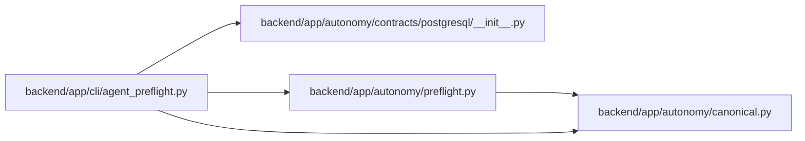

# agent_preflight Module

**Path:** `backend/app/cli/agent_preflight.py`

## Description

Fail-closed local diagnostic for the autonomous PostgreSQL start gate.

## Imports

| Source | Symbols |
|--------|---------|
| `__future__` | `annotations` |
| `app.autonomy.canonical` | `sha256_hex` |
| `app.autonomy.contracts.postgresql` | `load_postgresql_contract_bundle` |
| `app.autonomy.preflight` | `evaluate_agent_preflight` |
| `argparse` | `argparse` |
| `json` | `json` |
| `pathlib` | `Path` |
| `subprocess` | `subprocess` |

## Local dependency map

<!-- Auto-generated local dependency summary. Do not edit by hand. -->

### Internal neighbors

| Direction | Module |
|---|---|
| Outbound | [autonomy_canonical](../modules/autonomy_canonical.md) |
| Outbound | [postgresql___init__](../modules/postgresql___init__.md) |
| Outbound | [preflight](../modules/preflight.md) |

## Functions

| Function | Signature | Decorators | Description |
|----------|-----------|------------|-------------|
| `_release_fingerprint` | `() -> str` | — | — |
| `parse_args` | `(argv: list[str] \| None = None) -> argparse.Namespace` | — | — |
| `main` | `(argv: list[str] \| None = None) -> int` | — | — |
