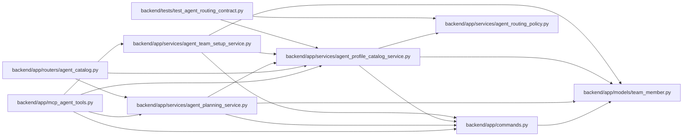

# agent_profile_catalog_service Module

**Path:** `backend/app/services/agent_profile_catalog_service.py`

## Description

Code-owned capability catalog, profile presets, and explainable agent routes.

## Imports

| Source | Symbols |
|--------|---------|
| `__future__` | `annotations` |
| `app.commands` | `commit_or_flush` |
| `app.models.team_member` | `TeamMemberProfile`, `TeamMemberProfileSkill` |
| `app.services.agent_routing_policy` | `CAPABILITY_LABEL_SKILL_KEYS`, `ROUTING_SKILL_DEFINITIONS` |
| `sqlalchemy` | `select` |
| `sqlalchemy.exc` | `IntegrityError` |
| `sqlalchemy.ext.asyncio` | `AsyncSession` |
| `sqlalchemy.orm` | `selectinload` |
| `typing` | `Any` |

## Local dependency map

<!-- Auto-generated local dependency summary. Do not edit by hand. -->

### Internal neighbors

| Direction | Module |
|---|---|
| Inbound | [mcp_agent_tools](../modules/mcp_agent_tools.md) |
| Inbound | [agent_catalog](../modules/agent_catalog.md) |
| Inbound | [agent_planning_service](../modules/agent_planning_service.md) |
| Inbound | [agent_team_setup_service](../modules/agent_team_setup_service.md) |
| Inbound | [test_agent_routing_contract](../modules/test_agent_routing_contract.md) |
| Outbound | [commands](../modules/commands.md) |
| Outbound | [team_member](../modules/team_member.md) |
| Outbound | [agent_routing_policy](../modules/agent_routing_policy.md) |

### External packages

| Language | Used packages | Undeclared packages |
|---|---:|---:|
| python | 1 | 0 |

## Classes

| Class | Line | Bases | Description |
|-------|------|-------|-------------|
| [AgentProfileCatalogService](../entities/AgentProfileCatalogService.md) | 276 | — | Expose and apply stable capability/profile presets without granting permissions. |
