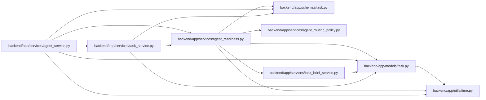

# agent_readiness Module

**Path:** `backend/app/services/agent_readiness.py`

## Description

Deterministic task readiness evaluation for agent handoff.

## Imports

| Source | Symbols |
|--------|---------|
| `app.models.task` | `Task`, `TaskDependency`, `TaskStatus` |
| `app.schemas.task` | `TaskAgentReadiness`, `TaskAgentReadinessCriterion` |
| `app.services.agent_routing_policy` | `CAPABILITY_LABEL_SKILL_KEYS` |
| `app.services.task_brief_service` | `brief_definition_blockers` |
| `app.utils.time` | `as_utc`, `utc_now` |
| `datetime` | `datetime` |
| `re` | `re` |
| `sqlalchemy.orm` | `attributes` |
| `typing` | `Any`, `Iterable`, `Optional`, `Sequence` |

## Local dependency map

<!-- Auto-generated local dependency summary. Do not edit by hand. -->

### Internal neighbors

| Direction | Module |
|---|---|
| Inbound | [agent_service](../modules/agent_service.md) |
| Inbound | [task_service](../modules/task_service.md) |
| Outbound | [models_task](../modules/models_task.md) |
| Outbound | [schemas_task](../modules/schemas_task.md) |
| Outbound | [agent_routing_policy](../modules/agent_routing_policy.md) |
| Outbound | [task_brief_service](../modules/task_brief_service.md) |
| Outbound | [time](../modules/time.md) |

### External packages

| Language | Used packages | Undeclared packages |
|---|---:|---:|
| python | 1 | 0 |

## Functions

| Function | Signature | Decorators | Description |
|----------|-----------|------------|-------------|
| `_dependency_task` | `(dependency: TaskDependency) -> Optional[Task]` | — | Return loaded dependency target without triggering lazy IO. |
| `_description_is_actionable` | `(description: Optional[str]) -> tuple[bool, str]` | — | Return whether task description gives enough execution/verification context. |
| `_add_criterion` | `(criteria: list[TaskAgentReadinessCriterion], blockers: list[str], *, key: str, label: str, passed: bool, reason: str) -> None` | — | Append one criterion and record failed reasons as blockers. |
| `evaluate_agent_readiness` | `(task: Task, *, tags: Iterable[str], children: Sequence[Task], dependencies: Sequence[TaskDependency], now: Optional[datetime] = None, current_actor_id: Optional[int] = None, capability_slugs: Optional[set[str]] = None) -> TaskAgentReadiness` | — | Evaluate whether a task is ready for explicit agent execution. |
