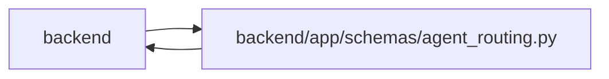

# agent_routing Module

**Path:** `backend/app/schemas/agent_routing.py`

## Description

Provider-neutral model-routing boundary contracts.

These schemas deliberately contain no credentials, provider endpoints, prompts,
or runtime logs. They normalize the same bounded vocabulary for persistence,
REST, MCP, and deterministic policy tests.

## Imports

| Source | Symbols |
|--------|---------|
| `__future__` | `annotations` |
| `app.services.agent_routing_policy` | `ASSESSMENT_REASON_CODES`, `MAX_ROUTING_CANDIDATES`, `MAX_ROUTING_EXCLUSIONS`, `MAX_ROUTING_PACKET_BYTES`, `MIN_ROUTING_ASSESSMENT_CONFIDENCE`, `ROUTING_PREVIEW_TTL_SECONDS`, `AssessmentReasonCode`, `ContextTier`, `CostTier`, `DifficultyBand`, `LatencyTier`, `ROUTING_POLICY_VERSION`, `ROUTING_SKILL_KEYS`, `ReasoningTier`, `ReviewMode`, `RoutingBlockerCode`, `assessment_confidence_meets_minimum`, `canonical_routing_json_bytes`, `derive_difficulty_band`, `minimum_review_mode`, `review_mode_meets`, `validate_routing_packet_size` |
| `collections.abc` | `Mapping` |
| `datetime` | `datetime` |
| `math` | `math` |
| `pydantic` | `BaseModel`, `ConfigDict`, `Field`, `StringConstraints`, `ValidationError`, `field_validator`, `model_validator` |
| `re` | `re` |
| `typing` | `Annotated`, `Any`, `Literal` |

## Local dependency map

<!-- Auto-generated local dependency summary. Do not edit by hand. -->

> Module-level dependencies exceed the generated-diagram limits, so the diagram and table below group them by top-level package. Counts report the number of module neighbors in each package.

### Internal neighbors

| Direction | Module |
|---|---|
| Inbound | `backend` (15) |
| Outbound | `backend` (1) |

### External packages

| Language | Used packages | Undeclared packages |
|---|---:|---:|
| python | 1 | 0 |

> All 16 module neighbor(s) are summarized by package because the module-level view exceeds the 12-node limit.

## Classes

| Class | Kind | Line | Bases / Target | Description |
|-------|------|------|----------------|-------------|
| [RoutingKey](../entities/RoutingKey.md) | Type alias | 58 | `Annotated[str, StringConstraints(strip_whitespace=True, to_lower=True, min_length=1, max_length=120, pattern='^[a-z0-9](?:[a-z0-9._-]*[a-z0-9])?$')]` | — |
| [DifficultyScore](../entities/DifficultyScore.md) | Type alias | 68 | `Annotated[int, Field(strict=True, ge=1, le=3)]` | — |
| [SkillLevel](../entities/SkillLevel.md) | Type alias | 69 | `Annotated[int, Field(strict=True, ge=1, le=5)]` | — |
| [PositiveRevision](../entities/PositiveRevision.md) | Type alias | 70 | `Annotated[int, Field(strict=True, ge=1)]` | — |
| [RoutingDigest](../entities/RoutingDigest.md) | Type alias | 71 | `Annotated[str, StringConstraints(strip_whitespace=True, to_lower=True, min_length=64, max_length=64, pattern='^[0-9a-f]{64}$')]` | — |
| [RoutingContractModel](../entities/RoutingContractModel.md) | Pydantic model | 204 | `BaseModel` | Strict deterministic base for data crossing a routing boundary. |
| [AgentModelCatalogFields](../entities/AgentModelCatalogFields.md) | Pydantic model | 228 | `RoutingContractModel` | Secret-free provider-neutral model catalog fields. |
| [AgentModelCatalogCreate](../entities/agent_routing_AgentModelCatalogCreate.md) | Pydantic model | 272 | `AgentModelCatalogFields` | Create payload for a catalog entry. |
| [AgentModelCatalogUpdate](../entities/agent_routing_AgentModelCatalogUpdate.md) | Pydantic model | 278 | `RoutingContractModel` | Optimistic partial update for one catalog entry. |
| [AgentModelCatalogDisable](../entities/agent_routing_AgentModelCatalogDisable.md) | Pydantic model | 358 | `RoutingContractModel` | Optimistic soft-disable command for a catalog entry. |
| [AgentModelCatalogResponse](../entities/AgentModelCatalogResponse.md) | Pydantic model | 365 | `AgentModelCatalogFields` | Persisted catalog projection. |
| [AgentModelBindingFields](../entities/AgentModelBindingFields.md) | Pydantic model | 373 | `RoutingContractModel` | Versioned runtime binding owned by one exact actor. |
| [AgentModelBindingCreate](../entities/agent_routing_AgentModelBindingCreate.md) | Pydantic model | 401 | `AgentModelBindingFields` | Create payload for an actor-model binding. |
| [AgentModelBindingUpdate](../entities/agent_routing_AgentModelBindingUpdate.md) | Pydantic model | 407 | `RoutingContractModel` | Optimistic partial update for one actor-model binding. |
| [AgentModelBindingDisable](../entities/agent_routing_AgentModelBindingDisable.md) | Pydantic model | 466 | `RoutingContractModel` | Optimistic soft-disable command for an actor-model binding. |
| [AgentModelBindingResponse](../entities/AgentModelBindingResponse.md) | Pydantic model | 473 | `AgentModelBindingFields` | Persisted binding projection. |
| [AgentModelMutationReceipt](../entities/agent_routing_AgentModelMutationReceipt.md) | Pydantic model | 487 | `RoutingContractModel` | Durable, replay-safe receipt for an operator model mutation. |
| [TaskDifficultyAxes](../entities/agent_routing_TaskDifficultyAxes.md) | Pydantic model | 503 | `RoutingContractModel` | Five governed task-difficulty axes on a closed 1..3 scale. |
| [RequiredModelEnvelope](../entities/agent_routing_RequiredModelEnvelope.md) | Pydantic model | 522 | `RoutingContractModel` | Minimum provider-neutral runtime capabilities required by a task. |
| [TaskRoutingAssessmentFields](../entities/TaskRoutingAssessmentFields.md) | Pydantic model | 547 | `RoutingContractModel` | Immutable assessment bound to one concrete task version. |
| [TaskRoutingAssessmentCreate](../entities/TaskRoutingAssessmentCreate.md) | Pydantic model | 606 | `TaskRoutingAssessmentFields` | Create payload for one append-only assessment. |
| [TaskRoutingAssessmentCommand](../entities/agent_routing_TaskRoutingAssessmentCommand.md) | Pydantic model | 610 | `RoutingContractModel` | Authorized client input; identity and policy fields are server-owned. |
| [PersistedTaskRoutingAssessmentFields](../entities/PersistedTaskRoutingAssessmentFields.md) | Pydantic model | 658 | `BaseModel` | Backward-compatible decoder for rows written under the original v1 schema. |
| [TaskRoutingAssessmentResponse](../entities/TaskRoutingAssessmentResponse.md) | Pydantic model | 753 | `PersistedTaskRoutingAssessmentFields` | Audit-readable assessment projection with fail-closed routeability. |
| [TaskRoutingAssessmentState](../entities/agent_routing_TaskRoutingAssessmentState.md) | Pydantic model | 801 | `RoutingContractModel` | Explicit current, stale, or absent assessment state for one task. |
| [TaskRoutingAssessmentListResponse](../entities/TaskRoutingAssessmentListResponse.md) | Pydantic model | 833 | `RoutingContractModel` | Bounded newest-first assessment history for one task. |
| [TaskRoutingAssessmentMutationReceipt](../entities/agent_routing_TaskRoutingAssessmentMutationReceipt.md) | Pydantic model | 869 | `RoutingContractModel` | Durable replay-safe receipt for an authoritative assessment write. |
| [AgentRoutingPreviewCreate](../entities/agent_routing_AgentRoutingPreviewCreate.md) | Pydantic model | 917 | `RoutingContractModel` | Non-dispatching exact-actor preview bound to current task state. |
| [AgentRoutingCandidate](../entities/agent_routing_AgentRoutingCandidate.md) | Pydantic model | 926 | `RoutingContractModel` | One eligible actor plus exact model-binding candidate. |
| [AgentRoutingExclusion](../entities/agent_routing_AgentRoutingExclusion.md) | Pydantic model | 1005 | `RoutingContractModel` | Bounded reason evidence for one ineligible actor/binding pair. |
| [AgentRoutingPreviewResponse](../entities/agent_routing_AgentRoutingPreviewResponse.md) | Pydantic model | 1123 | `RoutingContractModel` | Expiring non-dispatch result over a digest-bound routing input snapshot. |
| [RoutingCandidateSummary](../entities/RoutingCandidateSummary.md) | Pydantic model | 1239 | `RoutingContractModel` | Compact ordered eligible-candidate evidence retained on assignment. |
| [RoutingExclusionSummary](../entities/RoutingExclusionSummary.md) | Pydantic model | 1253 | `RoutingContractModel` | Compact actionable exclusion evidence retained on assignment. |
| [RoutingTrustLineage](../entities/RoutingTrustLineage.md) | Pydantic model | 1284 | `RoutingContractModel` | Secret-free identities responsible for each routing evidence boundary. |
| [RoutingDecisionSnapshot](../entities/RoutingDecisionSnapshot.md) | Pydantic model | 1319 | `RoutingContractModel` | Immutable server-generated evidence for one exact routing selection. |

## Functions

| Function | Signature | Decorators | Description |
|----------|-----------|------------|-------------|
| `_normalize_tags` | `(values: list[Any], *, label: str) -> list[str]` | — | — |
| `_normalize_routing_keys` | `(values: list[Any], *, label: str, maximum_entries: int = MAX_REQUIRED_SKILLS) -> list[str]` | — | — |
| `_normalize_required_skill_levels` | `(value: Any) -> Any` | — | — |
| `_normalize_assessment_reason_codes` | `(value: Any) -> Any` | — | — |
| `_strip_nonempty_assessment_text` | `(value: str) -> str` | — | — |
| `_validate_assessment_band_and_review` | `(value: Any) -> None` | — | — |
