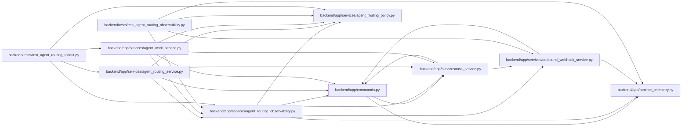

# agent_routing_observability Module

**Path:** `backend/app/services/agent_routing_observability.py`

## Description

Bounded operational evidence for model-aware routing.

Routing telemetry deliberately uses a closed event vocabulary and closed payload
fields.  Task prose, prompts, provider configuration, credentials, raw model
identifiers, and arbitrary evidence never cross this boundary.

## Imports

| Source | Symbols |
|--------|---------|
| `__future__` | `annotations` |
| `app.commands` | `commit_or_flush` |
| `app.runtime_telemetry` | `metrics` |
| `app.services.agent_routing_policy` | `MAX_ROUTING_EXCLUSIONS`, `MODEL_FAILURE_CATEGORIES`, `NON_MODEL_FAILURE_CATEGORY`, `ROUTING_POLICY_VERSION`, `canonical_routing_json_bytes` |
| `app.services.outbound_webhook_service` | `emit_outbound_webhook_event` |
| `app.services.task_service` | `TaskService` |
| `enum` | `StrEnum` |
| `hashlib` | `hashlib` |
| `json` | `json` |
| `sqlalchemy.ext.asyncio` | `AsyncSession` |
| `typing` | `Any`, `Mapping`, `Sequence` |

## Local dependency map

<!-- Auto-generated local dependency summary. Do not edit by hand. -->

### Internal neighbors

| Direction | Module |
|---|---|
| Inbound | [agent_routing_service](../modules/agent_routing_service.md) |
| Inbound | [agent_work_service](../modules/agent_work_service.md) |
| Inbound | [test_agent_routing_observability](../modules/test_agent_routing_observability.md) |
| Inbound | [test_agent_routing_rollout](../modules/test_agent_routing_rollout.md) |
| Outbound | [commands](../modules/commands.md) |
| Outbound | [runtime_telemetry](../modules/runtime_telemetry.md) |
| Outbound | [agent_routing_policy](../modules/agent_routing_policy.md) |
| Outbound | [outbound_webhook_service](../modules/outbound_webhook_service.md) |
| Outbound | [task_service](../modules/task_service.md) |

### External packages

| Language | Used packages | Undeclared packages |
|---|---:|---:|
| python | 1 | 0 |

## Classes

| Class | Kind | Line | Bases / Target | Description |
|-------|------|------|----------------|-------------|
| [RoutingOperationalEvent](../entities/RoutingOperationalEvent.md) | Enum | 39 | `StrEnum` | Closed, low-cardinality routing outcome vocabulary. |

## Functions

| Function | Signature | Decorators | Description |
|----------|-----------|------------|-------------|
| `opaque_value_digest` | `(value: str \| None) -> str \| None` | — | Hash an opaque runtime identity when correlation is operationally useful. |
| `_bounded_code` | `(value: Any, *, field: str) -> str` | — | — |
| `_bounded_scalar` | `(value: Any, *, field: str) -> str` | — | — |
| `_code_list` | `(value: Any, *, field: str, max_items: int = MAX_ROUTING_OPERATIONAL_CODES) -> list[str]` | — | — |
| `_excluded_candidates` | `(value: Any) -> list[dict[str, Any]]` | — | — |
| `build_routing_operational_payload` | `(event: RoutingOperationalEvent \| str, values: Mapping[str, Any]) -> dict[str, Any]` | — | Validate one secret-free operational projection and enforce its byte cap. |
| `record_routing_operational_event` | *(async)* `(db: AsyncSession, *, event: RoutingOperationalEvent \| str, task_id: int, values: Mapping[str, Any], actor_id: int \| None = None, correlation_id: str \| None = None, idempotency_key: str \| None = None, commit: bool = False) -> int` | — | Stage a task audit event, durable webhook intent, and aggregate metric. |
| `routing_exclusion_projection` | `(exclusions: Sequence[Any]) -> dict[str, Any]` | — | Project exclusions without allowing telemetry to fail a valid preview. |
