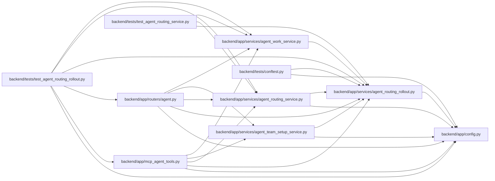

# agent_routing_rollout Module

**Path:** `backend/app/services/agent_routing_rollout.py`

## Description

Fail-closed rollout controls for model-aware agent routing.

## Imports

| Source | Symbols |
|--------|---------|
| `__future__` | `annotations` |
| `app.config` | `get_settings` |
| `contextvars` | `ContextVar`, `Token` |
| `dataclasses` | `dataclass` |
| `enum` | `StrEnum` |
| `re` | `re` |
| `typing` | `Any` |

## Local dependency map

<!-- Auto-generated local dependency summary. Do not edit by hand. -->

### Internal neighbors

| Direction | Module |
|---|---|
| Inbound | [mcp_agent_tools](../modules/mcp_agent_tools.md) |
| Inbound | [routers_agent](../modules/routers_agent.md) |
| Inbound | [agent_routing_service](../modules/agent_routing_service.md) |
| Inbound | [agent_team_setup_service](../modules/agent_team_setup_service.md) |
| Inbound | [agent_work_service](../modules/agent_work_service.md) |
| Inbound | [conftest](../modules/conftest.md) |
| Inbound | [test_agent_routing_rollout](../modules/test_agent_routing_rollout.md) |
| Inbound | [test_agent_routing_service](../modules/test_agent_routing_service.md) |
| Outbound | [config](../modules/config.md) |

## Classes

| Class | Kind | Line | Bases / Target | Description |
|-------|------|------|----------------|-------------|
| [AgentRoutingRolloutMode](../entities/AgentRoutingRolloutMode.md) | Enum | 22 | `StrEnum` | Deployment-owned model-aware routing rollout modes. |
| [AgentRoutingTopologyReadinessStatus](../entities/AgentRoutingTopologyReadinessStatus.md) | Enum | 30 | `StrEnum` | Closed readiness states supplied by the setup authority. |
| [AgentRoutingTopologyReadinessSource](../entities/AgentRoutingTopologyReadinessSource.md) | Enum | 38 | `StrEnum` | Closed authorities allowed to supply topology readiness. |
| [AgentRoutingTopologyReadiness](../entities/AgentRoutingTopologyReadiness.md) | Class | 46 | — | Narrow, secret-free input supplied by a server-side topology authority. |
| [AgentRoutingRolloutStatus](../entities/AgentRoutingRolloutStatus.md) | Class | 204 | — | Effective server state after applying fail-closed readiness controls. |
| [AgentRoutingRolloutError](../entities/AgentRoutingRolloutError.md) | Class | 225 | `RuntimeError` | Typed guard failure for preview or enforced dispatch. |
| [AgentRoutingRolloutService](../entities/AgentRoutingRolloutService.md) | Class | 234 | — | Resolve deployment mode against authoritative topology readiness. |

## Functions

| Function | Signature | Decorators | Description |
|----------|-----------|------------|-------------|
| `set_agent_routing_topology_readiness` | `(readiness: AgentRoutingTopologyReadiness) -> Token[AgentRoutingTopologyReadiness \| None]` | — | Inject server-derived readiness for the current request/task context. |
| `reset_agent_routing_topology_readiness` | `(token: Token[AgentRoutingTopologyReadiness \| None]) -> None` | — | Restore the prior request/task readiness input. |
