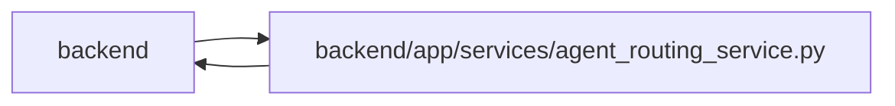

# agent_routing_service Module

**Path:** `backend/app/services/agent_routing_service.py`

## Description

Authoritative assessment, preview, and selection validation for agent routing.

## Imports

| Source | Symbols |
|--------|---------|
| `__future__` | `annotations` |
| `app.commands` | `commit_or_flush` |
| `app.config` | `get_settings` |
| `app.models.agent` | `AgentActor`, `AgentIdempotencyRecord`, `AgentModelBinding`, `AgentRun`, `AgentTaskAssignment`, `TaskRoutingAssessment` |
| `app.models.iteration` | `Iteration` |
| `app.models.task` | `Task`, `TaskStatus` |
| `app.models.team_member` | `TeamMember`, `TeamMemberProfile` |
| `app.query_limits` | `CollectionLimitExceededError` |
| `app.schemas.agent_planning` | `AgentPlanningCommandContext` |
| `app.schemas.agent_routing` | `AgentRoutingCandidate`, `AgentRoutingExclusion`, `AgentRoutingPreviewCreate`, `AgentRoutingPreviewResponse`, `RoutingDecisionSnapshot`, `TaskRoutingAssessmentCommand`, `TaskRoutingAssessmentCreate`, `TaskRoutingAssessmentListResponse`, `TaskRoutingAssessmentMutationReceipt`, `TaskRoutingAssessmentResponse`, `TaskRoutingAssessmentState` |
| `app.services.agent_routing_observability` | `RoutingOperationalEvent`, `record_routing_operational_event`, `routing_exclusion_projection` |
| `app.services.agent_routing_policy` | `MAX_ROUTING_CANDIDATES`, `MAX_ROUTING_EXCLUSIONS`, `MAX_ROUTING_PACKET_BYTES`, `MIN_ROUTING_ASSESSMENT_CONFIDENCE`, `MODEL_FAILURE_CATEGORIES`, `REVIEW_MODE_ORDER`, `ROUTING_DECISION_AUTHORITY`, `ROUTING_DECISION_LINEAGE_FIELDS`, `ROUTING_LINEAGE_AUTHORITY`, `ROUTING_POLICY_VERSION`, `ROUTING_PREVIEW_TTL_SECONDS`, `RoutingBlockerCode`, `RoutingProfileEvidence`, `canonical_routing_json_bytes`, `evaluate_actor_authorization`, `evaluate_assignment_compatibility`, `evaluate_model_envelope`, `evaluate_required_skills`, `normalize_model_failure_category`, `routing_candidate_rank_key`, `review_mode_meets`, `validate_routing_packet_size` |
| `app.services.agent_routing_rollout` | `AgentRoutingRolloutError`, `AgentRoutingRolloutMode`, `AgentRoutingRolloutService`, `AgentRoutingTopologyReadinessStatus` |
| `app.services.agent_service` | `AgentConflictError`, `AgentPermissionError`, `actor_has_scope`, `actor_scopes`, `validate_idempotency_key` |
| `app.services.calendar_service` | `CalendarService` |
| `app.services.task_service` | `TaskService`, `TaskVersionConflictError` |
| `app.utils.time` | `as_utc`, `utc_now` |
| `dataclasses` | `dataclass` |
| `datetime` | `UTC`, `datetime`, `timedelta` |
| `hashlib` | `hashlib` |
| `hmac` | `hmac` |
| `json` | `json` |
| `math` | `math` |
| `secrets` | `secrets` |
| `sqlalchemy` | `func`, `select`, `text` |
| `sqlalchemy.exc` | `IntegrityError` |
| `sqlalchemy.ext.asyncio` | `AsyncSession` |
| `sqlalchemy.orm` | `selectinload` |
| `typing` | `Any`, `Sequence` |

## Local dependency map

<!-- Auto-generated local dependency summary. Do not edit by hand. -->

> Module-level dependencies exceed the generated-diagram limits, so the diagram and table below group them by top-level package. Counts report the number of module neighbors in each package.

### Internal neighbors

| Direction | Module |
|---|---|
| Inbound | `backend` (11) |
| Outbound | `backend` (16) |

### External packages

| Language | Used packages | Undeclared packages |
|---|---:|---:|
| python | 1 | 0 |

> All 27 module neighbor(s) are summarized by package because the module-level view exceeds the 12-node limit.

## Classes

| Class | Line | Bases | Description |
|-------|------|-------|-------------|
| [AgentRoutingConflictError](../entities/AgentRoutingConflictError.md) | 114 | `AgentConflictError` | Stable routing conflict shared by REST, MCP, and assignment commands. |
| [RoutingSelectionValidation](../entities/RoutingSelectionValidation.md) | 134 | — | Authoritative result consumed inside the assignment transaction. |
| [AgentRoutingService](../entities/AgentRoutingService.md) | 201 | — | Create immutable assessments and deterministic exact-actor previews. |

## Functions

| Function | Signature | Decorators | Description |
|----------|-----------|------------|-------------|
| `_request_hash` | `(payload: dict[str, Any]) -> str` | — | — |
| `_json_value` | `(value: Any, fallback: Any) -> Any` | — | — |
| `_brief_sections` | `(description: str \| None) -> dict[str, str]` | — | — |
| `_assessment_payload` | `(record: TaskRoutingAssessment) -> dict[str, Any]` | — | — |
| `_json_projection` | `(value: Any) -> Any` | — | Convert nested schema/time values to the canonical JSON-native boundary. |
