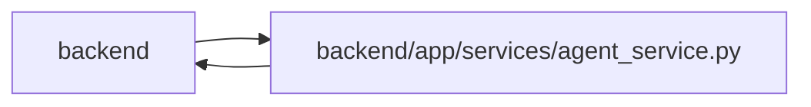

# agent_service Module

**Path:** `backend/app/services/agent_service.py`

## Description

Agent integration services.

## Imports

| Source | Symbols |
|--------|---------|
| `app.commands` | `commit_or_flush` |
| `app.config` | `get_settings` |
| `app.models.agent` | `AgentActor`, `AgentIdempotencyRecord`, `AgentModelBinding`, `AgentModelCatalogEntry`, `AgentRun`, `AgentRunEvent`, `AgentTaskAssignment`, `TaskEvent` |
| `app.models.label` | `Label`, `LabelGroup` |
| `app.models.task` | `Task`, `TaskDependency`, `TaskStatus` |
| `app.models.team_member` | `TeamMemberProfile` |
| `app.query_limits` | `CollectionLimitExceededError`, `MAX_BOUNDED_LIST_ITEMS` |
| `app.schemas.agent` | `AgentActorCreate`, `AgentRunCreate`, `AgentRunEventCreate`, `AgentRunFinish`, `AgentTaskCreate`, `AgentTaskPatch`, `SUPPORTED_AGENT_SCOPES`, `TaskClaimRequest`, `TaskEventCreate` |
| `app.schemas.task` | `TaskCreate`, `TaskUpdate`, `TaskResponse` |
| `app.services.agent_readiness` | `evaluate_agent_readiness` |
| `app.services.outbound_webhook_service` | `emit_outbound_webhook_event` |
| `app.services.task_service` | `TaskService` |
| `app.utils.time` | `as_utc`, `utc_now` |
| `datetime` | `datetime`, `timedelta` |
| `hashlib` | `hashlib` |
| `json` | `json` |
| `secrets` | `secrets` |
| `sqlalchemy` | `select`, `text` |
| `sqlalchemy.exc` | `IntegrityError` |
| `sqlalchemy.ext.asyncio` | `AsyncSession` |
| `sqlalchemy.orm` | `selectinload` |
| `typing` | `Any`, `Optional`, `Sequence` |

## Local dependency map

<!-- Auto-generated local dependency summary. Do not edit by hand. -->

> Module-level dependencies exceed the generated-diagram limits, so the diagram and table below group them by top-level package. Counts report the number of module neighbors in each package.

### Internal neighbors

| Direction | Module |
|---|---|
| Inbound | `backend` (24) |
| Outbound | `backend` (13) |

### External packages

| Language | Used packages | Undeclared packages |
|---|---:|---:|
| python | 1 | 0 |

> All 37 module neighbor(s) are summarized by package because the module-level view exceeds the 12-node limit.

## Classes

| Class | Line | Bases | Description |
|-------|------|-------|-------------|
| [AgentConflictError](../entities/AgentConflictError.md) | 56 | `Exception` | Raised when an agent operation conflicts with current task state. |
| [AgentPermissionError](../entities/AgentPermissionError.md) | 60 | `Exception` | Raised when an agent lacks a required scope. |
| [AgentService](../entities/AgentService.md) | 110 | — | Service for agent authentication, task control, and run tracing. |

## Functions

| Function | Signature | Decorators | Description |
|----------|-----------|------------|-------------|
| `hash_api_key` | `(api_key: str) -> str` | — | Hash an agent API key for storage and lookup. |
| `actor_scopes` | `(actor: AgentActor) -> list[str]` | — | Parse an actor scope list. |
| `actor_has_scope` | `(actor: AgentActor, scope: str) -> bool` | — | Return whether an actor has the requested scope. |
| `require_scope` | `(actor: AgentActor, scope: str) -> None` | — | Raise if actor does not have scope. |
| `validate_idempotency_key` | `(value: Optional[str], *, required: bool = False) -> Optional[str]` | — | Validate one persistence-safe, log-safe idempotency key. |
