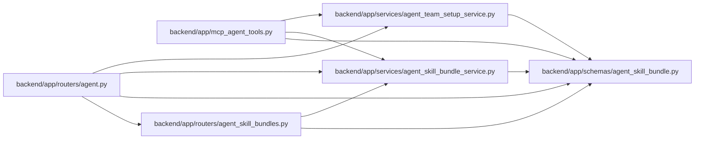

# agent_skill_bundle Module

**Path:** `backend/app/schemas/agent_skill_bundle.py`

## Description

Schemas for immutable, distributable agent role-skill bundles.

## Imports

| Source | Symbols |
|--------|---------|
| `__future__` | `annotations` |
| `pydantic` | `BaseModel`, `ConfigDict`, `Field` |
| `typing` | `Literal` |

## Local dependency map

<!-- Auto-generated local dependency summary. Do not edit by hand. -->

### Internal neighbors

| Direction | Module |
|---|---|
| Inbound | [mcp_agent_tools](../modules/mcp_agent_tools.md) |
| Inbound | [routers_agent](../modules/routers_agent.md) |
| Inbound | [agent_skill_bundles](../modules/agent_skill_bundles.md) |
| Inbound | [agent_skill_bundle_service](../modules/agent_skill_bundle_service.md) |
| Inbound | [agent_team_setup_service](../modules/agent_team_setup_service.md) |

### External packages

| Language | Used packages | Undeclared packages |
|---|---:|---:|
| python | 1 | 0 |

## Classes

| Class | Line | Bases | Description |
|-------|------|-------|-------------|
| [StrictBundleModel](../entities/StrictBundleModel.md) | 13 | `BaseModel` | Reject undeclared build metadata instead of serving it accidentally. |
| [SkillBundleFileRecord](../entities/SkillBundleFileRecord.md) | 19 | `StrictBundleModel` | One allow-listed file in an independently installable role skill. |
| [SkillBundleArchiveRecord](../entities/SkillBundleArchiveRecord.md) | 27 | `StrictBundleModel` | One exact downloadable archive representation of a role skill. |
| [SkillBundleCatalogEntry](../entities/SkillBundleCatalogEntry.md) | 36 | `StrictBundleModel` | Versioned compatibility and integrity manifest for one role skill. |
| [SkillBundleCatalogResponse](../entities/SkillBundleCatalogResponse.md) | 54 | `StrictBundleModel` | Canonical catalog emitted by the deterministic skill build. |
| [SkillBundleReleaseArtifact](../entities/SkillBundleReleaseArtifact.md) | 64 | `StrictBundleModel` | Whole-file checksum for one release artifact. |
| [SkillBundleReleaseIndex](../entities/SkillBundleReleaseIndex.md) | 72 | `StrictBundleModel` | Checksum index emitted beside the catalog and role archives. |
| [SkillBundleManifestResponse](../entities/SkillBundleManifestResponse.md) | 80 | `StrictBundleModel` | Exact-version manifest projected from the canonical catalog. |
| [SkillBundleDiscoveryResponse](../entities/SkillBundleDiscoveryResponse.md) | 88 | `StrictBundleModel` | Stable well-known pointer to the mutable catalog URL. |
