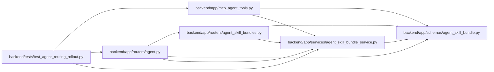

# agent_skill_bundle_service Module

**Path:** `backend/app/services/agent_skill_bundle_service.py`

## Description

Read-only delivery of deterministic agent role-skill build artifacts.

## Imports

| Source | Symbols |
|--------|---------|
| `__future__` | `annotations` |
| `app.schemas.agent_skill_bundle` | `SkillBundleArchiveRecord`, `SkillBundleCatalogEntry`, `SkillBundleCatalogResponse`, `SkillBundleDiscoveryResponse`, `SkillBundleManifestResponse`, `SkillBundleReleaseIndex` |
| `base64` | `base64` |
| `collections` | `Counter` |
| `dataclasses` | `dataclass` |
| `hashlib` | `hashlib` |
| `io` | `BytesIO` |
| `json` | `json` |
| `logging` | `logging` |
| `os` | `os` |
| `pathlib` | `Path`, `PurePosixPath` |
| `pydantic` | `ValidationError` |
| `re` | `re` |
| `stat` | `stat` |
| `threading` | `threading` |
| `typing` | `Any`, `Literal` |
| `zipfile` | `zipfile` |

## Local dependency map

<!-- Auto-generated local dependency summary. Do not edit by hand. -->

### Internal neighbors

| Direction | Module |
|---|---|
| Inbound | [mcp_agent_tools](../modules/mcp_agent_tools.md) |
| Inbound | [routers_agent](../modules/routers_agent.md) |
| Inbound | [agent_skill_bundles](../modules/agent_skill_bundles.md) |
| Inbound | [test_agent_routing_rollout](../modules/test_agent_routing_rollout.md) |
| Outbound | [agent_skill_bundle](../modules/agent_skill_bundle.md) |

### External packages

| Language | Used packages | Undeclared packages |
|---|---:|---:|
| python | 1 | 0 |

## Classes

| Class | Line | Bases | Description |
|-------|------|-------|-------------|
| [SkillBundleNotFoundError](../entities/SkillBundleNotFoundError.md) | 40 | `LookupError` | Raised when a requested exact skill, version, format, or file is absent. |
| [SkillBundleArtifactError](../entities/SkillBundleArtifactError.md) | 44 | `RuntimeError` | Raised when deployed build artifacts fail their integrity contract. |
| [SkillBundlePayload](../entities/SkillBundlePayload.md) | 49 | — | Exact response bytes and their transport integrity metadata. |
| [_LoadedRelease](../entities/LoadedRelease.md) | 81 | — | — |
| [_ReleaseLimits](../entities/ReleaseLimits.md) | 89 | — | — |
| [_CachedRelease](../entities/CachedRelease.md) | 98 | — | — |
| [AgentSkillBundleService](../entities/AgentSkillBundleService.md) | 114 | — | Validate and serve only files emitted by the deterministic skill build. |

## Functions

| Function | Signature | Decorators | Description |
|----------|-----------|------------|-------------|
| `default_skill_bundle_artifact_root` | `() -> Path` | — | Resolve the deployed artifact directory without reading application data. |
