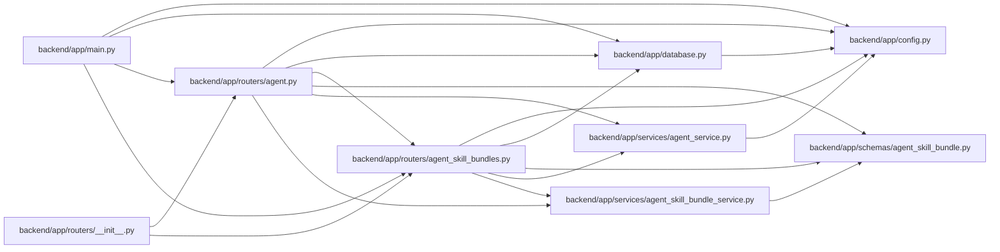

# agent_skill_bundles Module

**Path:** `backend/app/routers/agent_skill_bundles.py`

## Description

Read-only HTTP delivery for immutable agent role-skill artifacts.

## Imports

| Source | Symbols |
|--------|---------|
| `__future__` | `annotations` |
| `app.config` | `get_settings` |
| `app.database` | `get_db` |
| `app.schemas.agent_skill_bundle` | `SkillBundleCatalogResponse`, `SkillBundleDiscoveryResponse`, `SkillBundleManifestResponse` |
| `app.services.agent_service` | `AgentService`, `actor_has_scope` |
| `app.services.agent_skill_bundle_service` | `AgentSkillBundleService`, `SkillBundleArtifactError`, `SkillBundleNotFoundError`, `SkillBundlePayload` |
| `fastapi` | `APIRouter`, `Depends`, `HTTPException`, `Query`, `Request`, `Response`, `status` |
| `sqlalchemy.ext.asyncio` | `AsyncSession` |
| `typing` | `Annotated`, `Callable`, `Literal` |

## Local dependency map

<!-- Auto-generated local dependency summary. Do not edit by hand. -->

### Internal neighbors

| Direction | Module |
|---|---|
| Inbound | [app_main](../modules/app_main.md) |
| Inbound | [routers___init__](../modules/routers___init__.md) |
| Inbound | [routers_agent](../modules/routers_agent.md) |
| Outbound | [config](../modules/config.md) |
| Outbound | [app_database](../modules/app_database.md) |
| Outbound | [agent_skill_bundle](../modules/agent_skill_bundle.md) |
| Outbound | [agent_service](../modules/agent_service.md) |
| Outbound | [agent_skill_bundle_service](../modules/agent_skill_bundle_service.md) |

### External packages

| Language | Used packages | Undeclared packages |
|---|---:|---:|
| python | 2 | 0 |

## Functions

| Function | Signature | Decorators | Description |
|----------|-----------|------------|-------------|
| `get_agent_skill_bundle_service` | *(async)* `() -> AgentSkillBundleService` | — | Create a service against the configured code-owned artifact directory. |
| `require_agent_skill_bundle_access` | *(async)* `(request: Request, db: Annotated[AsyncSession, Depends(get_db)]) -> None` | — | Require skills:read unless public code-artifact delivery is explicit. |
| `_resolve_payload` | `(action: Callable[[], SkillBundlePayload]) -> SkillBundlePayload` | — | — |
| `_etag_matches` | `(if_none_match: str \| None, etag: str) -> bool` | — | — |
| `_response` | `(payload: SkillBundlePayload, request: Request) -> Response` | — | — |
| `discover_agent_skill_bundles` | *(async)* `(request: Request, service: Annotated[AgentSkillBundleService, Depends(get_agent_skill_bundle_service)], _access: Annotated[None, Depends(require_agent_skill_bundle_access)]) -> Response` | `@well_known_router.get('/.well-known/workchord-agent-skills.json', response_model=SkillBundleDiscoveryResponse)` | Advertise the current catalog URL without embedding instance data. |
| `list_agent_skill_bundles` | *(async)* `(request: Request, service: Annotated[AgentSkillBundleService, Depends(get_agent_skill_bundle_service)], _access: Annotated[None, Depends(require_agent_skill_bundle_access)]) -> Response` | `@router.get('/agent/skill-bundles', response_model=SkillBundleCatalogResponse)` | Serve the byte-exact mutable catalog emitted by the build. |
| `get_agent_skill_bundle_manifest` | *(async)* `(skill_name: str, version: str, request: Request, service: Annotated[AgentSkillBundleService, Depends(get_agent_skill_bundle_service)], _access: Annotated[None, Depends(require_agent_skill_bundle_access)]) -> Response` | `@router.get('/agent/skill-bundles/{skill_name}/{version}/manifest', response_model=SkillBundleManifestResponse)` | Serve one immutable exact-version role manifest. |
| `download_agent_skill_bundle` | *(async)* `(skill_name: str, version: str, request: Request, service: Annotated[AgentSkillBundleService, Depends(get_agent_skill_bundle_service)], _access: Annotated[None, Depends(require_agent_skill_bundle_access)], archive_format: Annotated[Literal['zip', 'tar.gz'], Query(alias='format')] = 'zip') -> Response` | `@router.get('/agent/skill-bundles/{skill_name}/{version}/download', responses={status.HTTP_200_OK: {'content': {'application/zip': {}, 'application/gzip': {}}}})` | Download an immutable zip or tar.gz role archive. |
| `inspect_agent_skill_bundle_file` | *(async)* `(skill_name: str, version: str, file_path: str, request: Request, service: Annotated[AgentSkillBundleService, Depends(get_agent_skill_bundle_service)], _access: Annotated[None, Depends(require_agent_skill_bundle_access)]) -> Response` | `@router.get('/agent/skill-bundles/{skill_name}/{version}/files/{file_path:path}', responses={status.HTTP_200_OK: {'content': {'text/markdown': {}, 'application/yaml': {}, 'application/octet-stream': {}}}})` | Inspect one catalog-allow-listed file from the immutable role archive. |
