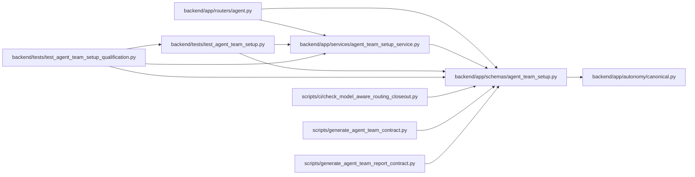

# agent_team_setup Module

**Path:** `backend/app/schemas/agent_team_setup.py`

## Description

Portable agent-team setup, reconciliation, and readiness contracts.

## Imports

| Source | Symbols |
|--------|---------|
| `__future__` | `annotations` |
| `app.autonomy.canonical` | `StrictContractModel`, `canonical_json_bytes`, `ensure_secret_free`, `sha256_hex` |
| `datetime` | `datetime` |
| `enum` | `StrEnum` |
| `pydantic` | `ConfigDict`, `Field`, `field_validator`, `model_validator` |
| `typing` | `Any`, `Literal`, `Mapping` |
| `urllib.parse` | `parse_qsl`, `urlsplit` |

## Local dependency map

<!-- Auto-generated local dependency summary. Do not edit by hand. -->

### Internal neighbors

| Direction | Module |
|---|---|
| Inbound | [routers_agent](../modules/routers_agent.md) |
| Inbound | [agent_team_setup_service](../modules/agent_team_setup_service.md) |
| Inbound | [test_agent_team_setup](../modules/test_agent_team_setup.md) |
| Inbound | [test_agent_team_setup_qualification](../modules/test_agent_team_setup_qualification.md) |
| Inbound | [check_model_aware_routing_closeout](../modules/check_model_aware_routing_closeout.md) |
| Inbound | [generate_agent_team_contract](../modules/generate_agent_team_contract.md) |
| Inbound | [generate_agent_team_report_contract](../modules/generate_agent_team_report_contract.md) |
| Outbound | [autonomy_canonical](../modules/autonomy_canonical.md) |

### External packages

| Language | Used packages | Undeclared packages |
|---|---:|---:|
| python | 1 | 0 |

## Classes

| Class | Kind | Line | Bases / Target | Description |
|-------|------|------|----------------|-------------|
| [UnsupportedAgentTeamMasterVersion](../entities/UnsupportedAgentTeamMasterVersion.md) | Class | 100 | `ValueError` | Raised when a caller submits an unknown manifest schema version. |
| [AgentTeamReconciliationClass](../entities/agent_team_setup_AgentTeamReconciliationClass.md) | Enum | 104 | `StrEnum` | — |
| [AgentTeamMemberLifecycle](../entities/AgentTeamMemberLifecycle.md) | Enum | 114 | `StrEnum` | — |
| [AgentTeamActionStatus](../entities/AgentTeamActionStatus.md) | Enum | 124 | `StrEnum` | — |
| [AgentTeamSetupModel](../entities/AgentTeamSetupModel.md) | Pydantic model | 155 | `StrictContractModel` | Strict base with JSON-schema metadata shared by setup contracts. |
| [AgentTeamSkillPackage](../entities/agent_team_setup_AgentTeamSkillPackage.md) | Pydantic model | 168 | `AgentTeamSetupModel` | Exact immutable role-package identity expected by one runtime. |
| [AgentTeamMemberSpec](../entities/agent_team_setup_AgentTeamMemberSpec.md) | Pydantic model | 176 | `AgentTeamSetupModel` | Portable desired state for one logical actor/runtime membership. |
| [AgentTeamReadinessPolicy](../entities/AgentTeamReadinessPolicy.md) | Pydantic model | 252 | `AgentTeamSetupModel` | Backend-owned minimum topology needed before runtime readiness. |
| [AgentTeamMaster](../entities/agent_team_setup_AgentTeamMaster.md) | Pydantic model | 264 | `AgentTeamSetupModel` | Canonical portable desired-state document for one agent team. |
| [AgentTeamCurrentMember](../entities/AgentTeamCurrentMember.md) | Pydantic model | 420 | `AgentTeamSetupModel` | Redacted authoritative member projection used by reconciliation. |
| [AgentTeamCurrentSnapshot](../entities/AgentTeamCurrentSnapshot.md) | Pydantic model | 432 | `AgentTeamSetupModel` | Current topology state with installation-local IDs kept separate. |
| [AgentTeamPlanAction](../entities/agent_team_setup_AgentTeamPlanAction.md) | Pydantic model | 444 | `AgentTeamSetupModel` | One stable, redacted reconciliation decision. |
| [AgentTeamReconciliationPlan](../entities/agent_team_setup_AgentTeamReconciliationPlan.md) | Pydantic model | 481 | `AgentTeamSetupModel` | Digest-bound dry-run output applied only by exact action ID. |
| [AgentTeamManifestRequest](../entities/AgentTeamManifestRequest.md) | Pydantic model | 713 | `AgentTeamSetupModel` | — |
| [AgentTeamValidateResponse](../entities/AgentTeamValidateResponse.md) | Pydantic model | 717 | `AgentTeamSetupModel` | — |
| [AgentTeamPlanRequest](../entities/AgentTeamPlanRequest.md) | Pydantic model | 728 | `AgentTeamSetupModel` | — |
| [AgentTeamApplyRequest](../entities/AgentTeamApplyRequest.md) | Pydantic model | 733 | `AgentTeamSetupModel` | — |
| [AgentTeamActionReceipt](../entities/agent_team_setup_AgentTeamActionReceipt.md) | Pydantic model | 762 | `AgentTeamSetupModel` | — |
| [AgentTeamApplyResponse](../entities/agent_team_setup_AgentTeamApplyResponse.md) | Pydantic model | 776 | `AgentTeamSetupModel` | — |
| [AgentTeamRuntimeAcknowledgement](../entities/AgentTeamRuntimeAcknowledgement.md) | Pydantic model | 801 | `AgentTeamSetupModel` | — |
| [AgentTeamRuntimeAcknowledgementResponse](../entities/AgentTeamRuntimeAcknowledgementResponse.md) | Pydantic model | 847 | `AgentTeamSetupModel` | — |
| [AgentTeamRuntimeHandoff](../entities/agent_team_setup_AgentTeamRuntimeHandoff.md) | Pydantic model | 864 | `AgentTeamSetupModel` | — |
| [AgentTeamMemberStatus](../entities/agent_team_setup_AgentTeamMemberStatus.md) | Pydantic model | 892 | `AgentTeamSetupModel` | — |
| [AgentTeamSetupStep](../entities/agent_team_setup_AgentTeamSetupStep.md) | Pydantic model | 930 | `AgentTeamSetupModel` | — |
| [AgentTeamStatusResponse](../entities/AgentTeamStatusResponse.md) | Pydantic model | 945 | `AgentTeamSetupModel` | — |
| [AgentTeamSetupReportCounts](../entities/AgentTeamSetupReportCounts.md) | Pydantic model | 979 | `AgentTeamSetupModel` | Bounded lifecycle and current-work counts without member internals. |
| [AgentTeamSetupReportEvidence](../entities/AgentTeamSetupReportEvidence.md) | Pydantic model | 1016 | `AgentTeamSetupModel` | Durable reconciliation evidence summarized without action payloads. |
| [AgentTeamDispatchAvailability](../entities/AgentTeamDispatchAvailability.md) | Pydantic model | 1034 | `AgentTeamSetupModel` | Explicitly withhold availability claims without task-bound evidence. |
| [AgentTeamSetupReport](../entities/AgentTeamSetupReport.md) | Pydantic model | 1064 | `AgentTeamSetupModel` | Portable redacted topology report derived only from current server state. |

## Functions

| Function | Signature | Decorators | Description |
|----------|-----------|------------|-------------|
| `_normalize_unique_keys` | `(values: tuple[str, ...], *, label: str) -> tuple[str, ...]` | — | — |
| `_validate_reference` | `(value: str, *, label: str) -> str` | — | — |
| `ensure_agent_team_secret_free` | `(value: Any) -> None` | — | Enforce setup-specific secret, prompt, environment, and log exclusions. |
| `parse_agent_team_master` | `(value: Any) -> AgentTeamMaster` | — | Validate one supported manifest and return its canonical model. |
| `_member_projection` | `(member: AgentTeamMemberSpec) -> dict[str, Any]` | — | — |
| `_build_action` | `(*, desired: AgentTeamMaster, actor_key: str, classification: AgentTeamReconciliationClass, operation: str, target_actor_id: int \| None, expected_object_revision: int \| None, expected_actor_revision: int \| None, before: dict[str, Any] \| None, after: dict[str, Any] \| None, blocker_code: str \| None = None, requires_confirmation: bool = False, authority_change: bool = False) -> AgentTeamPlanAction` | — | — |
| `reconcile_agent_team_master` | `(desired: AgentTeamMaster, current: AgentTeamCurrentSnapshot) -> AgentTeamReconciliationPlan` | — | Derive a deterministic, non-destructive baseline reconciliation plan. |
