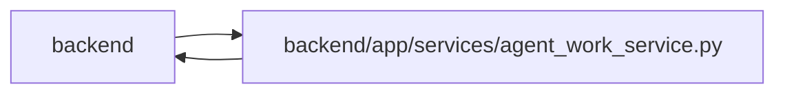

# agent_work_service Module

**Path:** `backend/app/services/agent_work_service.py`

## Description

Durable agent assignment, current-work, verification, and recovery services.

Assigned work retains exact actor, assignment, claim generation, model and task-context fences. Public mutation methods own an atomic transaction when called standalone and join their transport owner otherwise. Structured criterion evidence is saved inside the same submission as resolution. Independent rejection records its verdict, invalidates current progress and hands back fresh work without changing the historical executor.

Assigned definition and start decisions use complete inherited deferral policy. Live renewal, successful submission and fence replay recheck execution eligibility; ancestor edits invalidate descendant task context even when a legacy structural parent's summary flag is stale. Old worker fences cannot authorize changed scope, while existing failure, recovery and independent rework paths remain distinct.

## Imports

| Source | Symbols |
|--------|---------|
| `__future__` | `annotations` |
| `app.commands` | `atomic_command`, `commit_or_flush` |
| `app.models.agent` | `AgentActor`, `AgentIdempotencyRecord`, `AgentModelBinding`, `AgentRun`, `AgentTaskAssignment`, `TaskEvent` |
| `app.models.project` | `Project`, `ProjectUpdateEntry` |
| `app.models.task` | `Task`, `TaskDependency`, `TaskStatus` |
| `app.models.team_member` | `TeamMember`, `TeamMemberProfile` |
| `app.models.triage` | `TriageItem` |
| `app.query_limits` | `CollectionLimitExceededError`, `MAX_BOUNDED_LIST_ITEMS` |
| `app.schemas.agent` | `AgentActorResponse`, `AgentActorRosterProfile`, `AgentActorRosterProfileSkill`, `AgentDiscoveryTriageCreate`, `AgentDiscoveryTriageResponse`, `AgentProjectUpdateCreate`, `AgentProjectUpdateResponse`, `AgentActorRosterItem`, `AgentCollectionPageMetadata`, `AgentDependencyContext`, `AgentPaginationMetadata`, `AgentRecoveryListResponse`, `AgentReviewVerdict`, `AgentReviewVerdictResponse`, `AgentReviewQueueResponse`, `AgentRecoveryItem`, `AgentRecoveryRequeue`, `AgentRecoveryRequeueResponse`, `AgentRunResponse`, `AgentTaskAssignmentCreate`, `AgentTaskAssignmentResponse`, `AgentTaskAssignmentUpdate`, `AgentTaskContextResponse`, `AgentWorkBegin`, `AgentWorkBeginResponse`, `AgentWorkDecisionResponse`, `AgentWorkItem`, `AgentWorkPaginationMetadata`, `AgentWorkRenew`, `AgentWorkSubmit`, `AgentWorkTerminal`, `AgentWorkTerminalResponse`, `ModelAwareAgentTaskAssignmentCreate`, `ModelAwareAgentTaskAssignmentUpdate`, `ModelAwareAgentWorkBegin` |
| `app.schemas.agent_planning` | `AgentPlanningCommandContext` |
| `app.schemas.project` | `ProjectUpdateEntryCreate` |
| `app.schemas.triage` | `TriageItemCreate` |
| `app.services.agent_model_catalog_service` | `AgentModelCatalogService` |
| `app.services.agent_routing_observability` | `RoutingOperationalEvent`, `opaque_value_digest`, `record_routing_operational_event` |
| `app.services.agent_routing_policy` | `MODEL_FAILURE_CATEGORIES`, `ROUTING_DECISION_AUTHORITY`, `ROUTING_DECISION_LINEAGE_FIELDS`, `ROUTING_LINEAGE_AUTHORITY`, `ROUTING_POLICY_VERSION`, `canonical_routing_json_bytes`, `evaluate_actor_authorization`, `normalize_model_failure_category`, `validate_routing_packet_size` |
| `app.services.agent_routing_rollout` | `AgentRoutingRolloutError`, `AgentRoutingRolloutMode`, `AgentRoutingRolloutService`, `AgentRoutingTopologyReadinessStatus` |
| `app.services.agent_service` | `AgentConflictError`, `AgentPermissionError`, `actor_has_scope`, `actor_scopes`, `validate_idempotency_key` |
| `app.services.project_service` | `ProjectService` |
| `app.services.task_service` | `TaskService`, `TaskVersionConflictError` |
| `app.services.triage_service` | `TriageService` |
| `app.utils.time` | `as_utc`, `utc_now` |
| `base64` | `base64` |
| `binascii` | `binascii` |
| `datetime` | `date`, `datetime`, `timedelta` |
| `hashlib` | `hashlib` |
| `json` | `json` |
| `logging` | `logging` |
| `secrets` | `secrets` |
| `sqlalchemy` | `func`, `or_`, `select`, `text` |
| `sqlalchemy.ext.asyncio` | `AsyncSession` |
| `sqlalchemy.orm` | `selectinload` |
| `typing` | `Any`, `Callable`, `Iterable`, `Optional` |

## Local dependency map

<!-- Auto-generated local dependency summary. Do not edit by hand. -->

> Module-level dependencies exceed the generated-diagram limits, so the diagram and table below group them by top-level package. Counts report the number of module neighbors in each package.

### Internal neighbors

| Direction | Module |
|---|---|
| Inbound | `backend` (13) |
| Outbound | `backend` (20) |

### External packages

| Language | Used packages | Undeclared packages |
|---|---:|---:|
| python | 1 | 0 |

> All 33 module neighbor(s) are summarized by package because the module-level view exceeds the 12-node limit.

## Classes

| Class | Line | Bases | Description |
|-------|------|-------|-------------|
| [AgentWorkService](../entities/AgentWorkService.md) | 171 | — | Coordinate PM dispatch and low-freedom worker lifecycle commands. |

## Functions

| Function | Signature | Decorators | Description |
|----------|-----------|------------|-------------|
| `_json_loads` | `(value: Optional[str], fallback: Any) -> Any` | — | — |
| `parse_task_brief` | `(description: Optional[str]) -> dict[str, str]` | — | Parse level-two Markdown sections from the portable task-brief template. |
