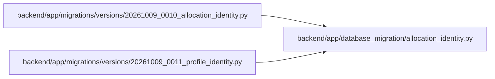

# allocation_identity Module

**Path:** `backend/app/database_migration/allocation_identity.py`

## Description

Reserve numeric allocation identities retained by immutable recovery history.

Forward identity qualification reserves live, referenced and retained recovery/audit allocation IDs with bounded history scans. Ambiguous or oversized history fails closed before changing identity state.

The bounded retained-history floor also qualifies person profile IDs from physical references, saved planning graphs and accountable profile audit events. Transfers preserve existing SQLite allocation sequence floors for both identity tables.

## Imports

| Source | Symbols |
|--------|---------|
| `json` | `json` |
| `sqlalchemy` | `MetaData`, `Table`, `cast`, `String`, `func`, `inspect`, `select`, `text` |

## Local dependency map

<!-- Auto-generated local dependency summary. Do not edit by hand. -->

### Internal neighbors

| Direction | Module |
|---|---|
| Inbound | [20261009_0010_allocation_identity](../modules/20261009_0010_allocation_identity.md) |
| Inbound | [20261009_0011_profile_identity](../modules/20261009_0011_profile_identity.md) |

### External packages

| Language | Used packages | Undeclared packages |
|---|---:|---:|
| python | 1 | 0 |

## Functions

| Function | Signature | Decorators | Description |
|----------|-----------|------------|-------------|
| `allocation_floor` | `(connection, table_name = 'team_members')` | — | — |