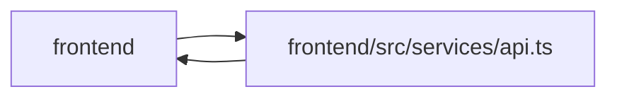

# api Module

**Path:** `frontend/src/services/api.ts`

## Description

_Auto-generated from `frontend/src/services/api.ts`._

## Imports

| Source | Symbols |
|--------|---------|
| `../utils/adminAccess` | `getAdminApiKey` |
| `../utils/agentAccess` | `getAgentApiKey` |
| `axios` | `axios`, `AxiosHeaders` |

## Module Signals

| Signal | Values |
|--------|--------|
| Exports | `default` |
| Constants | `api` |
| Module calls | `api = create`, `use` |

## Local dependency map

<!-- Auto-generated local dependency summary. Do not edit by hand. -->

> Module-level dependencies exceed the generated-diagram limits, so the diagram and table below group them by top-level package. Counts report the number of module neighbors in each package.

### Internal neighbors

| Direction | Module |
|---|---|
| Inbound | `frontend` (23) |
| Outbound | `frontend` (2) |

### External packages

| Language | Used packages | Undeclared packages |
|---|---:|---:|
| typescript | 1 | 0 |

> All 25 module neighbor(s) are summarized by package because the module-level view exceeds the 12-node limit.
