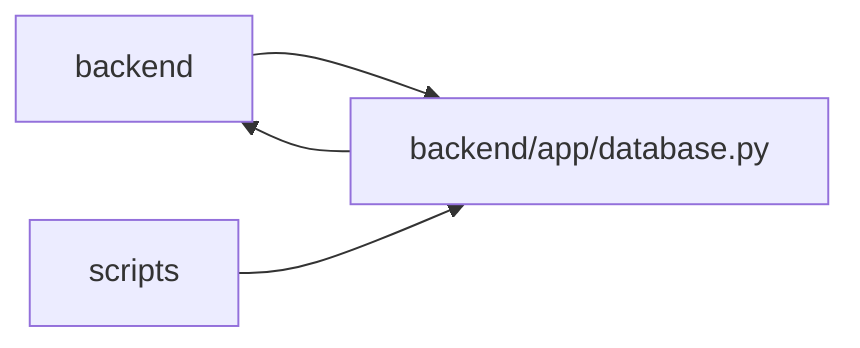

# database Module

**Path:** `backend/app/database.py`

## Description

_Auto-generated from `backend/app/database.py`._

## Imports

| Source | Symbols |
|--------|---------|
| `app.commands` | `command_transaction` |
| `app.config` | `get_settings` |
| `app.database_config` | `parse_database_configuration` |
| `app.observability` | `install_database_instrumentation` |
| `app.services.upgrade_service` | `assert_database_current` |
| `collections.abc` | `AsyncGenerator` |
| `fastapi` | `Request` |
| `pydantic` | `TypeAdapter`, `ValidationError` |
| `sqlalchemy` | `event` |
| `sqlalchemy.ext.asyncio` | `AsyncSession`, `create_async_engine`, `async_sessionmaker` |
| `sqlalchemy.orm` | `DeclarativeBase` |

## Local dependency map

<!-- Auto-generated local dependency summary. Do not edit by hand. -->

> Module-level dependencies exceed the generated-diagram limits, so the diagram and table below group them by top-level package. Counts report the number of module neighbors in each package.

### Internal neighbors

| Direction | Module |
|---|---|
| Inbound | `backend` (79) |
| Inbound | `scripts` (2) |
| Outbound | `backend` (5) |

### External packages

| Language | Used packages | Undeclared packages |
|---|---:|---:|
| python | 3 | 0 |

> All 84 module neighbor(s) are summarized by package because the module-level view exceeds the 12-node limit.

## Classes

| Class | Line | Bases | Description |
|-------|------|-------|-------------|
| [Base](../entities/Base.md) | 37 | `DeclarativeBase` | Base class for all models. |

## Functions

| Function | Signature | Decorators | Description |
|----------|-----------|------------|-------------|
| `enable_sqlite_foreign_keys` | `(dbapi_connection, _connection_record) -> None` | `@event.listens_for(engine.sync_engine, 'connect')` | — |
| `request_command_mode` | *(async)* `(request: Request) -> str` | — | Match DTO preview defaults before creating the root transaction. |
| `get_db` | *(async)* `(request: Request) -> AsyncGenerator[AsyncSession, None]` | — | Own each HTTP transaction before its response is sent (function-scoped dependency). |
| `init_db` | *(async)* `() -> None` | — | Verify the database schema is Alembic-current before serving traffic. |
| `close_database` | *(async)* `() -> None` | — | Release every pooled connection during process shutdown. |
| `database_runtime_summary` | `() -> dict[str, object]` | — | Return restart-bound pool policy without exposing credentials. |
