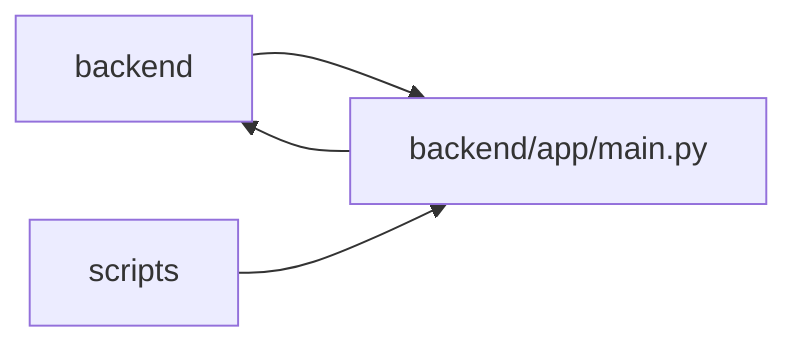

# main Module

**Path:** `backend/app/main.py`

## Description

_Auto-generated from `backend/app/main.py`._

## Imports

| Source | Symbols |
|--------|---------|
| `app.authority` | `AuthorityError` |
| `app.autonomy.contracts.postgresql` | `load_postgresql_contract_bundle` |
| `app.build_identity` | `load_backend_build_identity` |
| `app.commands` | `AggregateVersionConflict`, `HierarchyScopeError`, `PlanningConflict` |
| `app.config` | `get_settings` |
| `app.database` | `close_database`, `init_db` |
| `app.database_runtime` | `DatabaseConflictError`, `DatabaseUnavailableError` |
| `app.http_authority` | `enforce_http_authority` |
| `app.maintenance` | `MaintenanceModeError`, `RuntimeBoundaryMiddleware`, `maintenance_state` |
| `app.mcp_server` | `mcp`, `mount_mcp_http` |
| `app.mutation_versions` | `MissingMutationRevision` |
| `app.observability` | `collect_metrics`, `readiness_snapshot` |
| `app.query_limits` | `CollectionLimitExceededError` |
| `app.routers` | `identity`, `task_domain`, `capacity`, `delivery_dependencies`, `discussion`, `agent`, `agent_catalog`, `agent_planning`, `agent_skill_bundles`, `calendars`, `iterations`, `team`, `tasks`, `projects`, `gantt`, `github`, `intake`, `llm`, `export`, `snapshots`, `plan_shares`, `session`, `scheduling_rules`, `email_settings`, `triage`, `templates`, `labels`, `saved_views`, `request_sources`, `outbound_webhooks`, `system_settings` |
| `app.runtime_telemetry` | `metrics` |
| `contextlib` | `asynccontextmanager` |
| `fastapi` | `FastAPI`, `Request`, `status`, `Depends` |
| `fastapi.exceptions` | `RequestValidationError` |
| `fastapi.middleware.cors` | `CORSMiddleware` |
| `fastapi.responses` | `JSONResponse`, `PlainTextResponse` |
| `sqlalchemy.exc` | `TimeoutError` |

## Local dependency map

<!-- Auto-generated local dependency summary. Do not edit by hand. -->

> Module-level dependencies exceed the generated-diagram limits, so the diagram and table below group them by top-level package. Counts report the number of module neighbors in each package.

### Internal neighbors

| Direction | Module |
|---|---|
| Inbound | `backend` (12) |
| Inbound | `scripts` (4) |
| Outbound | `backend` (45) |

### External packages

| Language | Used packages | Undeclared packages |
|---|---:|---:|
| python | 2 | 0 |

> All 61 module neighbor(s) are summarized by package because the module-level view exceeds the 12-node limit.

## Functions

| Function | Signature | Decorators | Description |
|----------|-----------|------------|-------------|
| `lifespan` | *(async)* `(app: FastAPI)` | `@asynccontextmanager` | Application lifespan handler. |
| `planning_conflict` | *(async)* `(request: Request, exc: PlanningConflict)` | `@app.exception_handler(PlanningConflict)` | — |
| `missing_mutation_revision` | *(async)* `(request: Request, exc: MissingMutationRevision)` | `@app.exception_handler(MissingMutationRevision)` | — |
| `aggregate_version_conflict` | *(async)* `(request: Request, exc: AggregateVersionConflict)` | `@app.exception_handler(AggregateVersionConflict)` | — |
| `authority_error` | *(async)* `(request: Request, exc: AuthorityError)` | `@app.exception_handler(AuthorityError)` | — |
| `hierarchy_scope_error` | *(async)* `(request: Request, exc: HierarchyScopeError)` | `@app.exception_handler(HierarchyScopeError)` | — |
| `redact_request_validation_input` | *(async)* `(request: Request, exc: RequestValidationError) -> JSONResponse` | `@app.exception_handler(RequestValidationError)` | Return useful validation locations without echoing credentials or fences. |
| `maintenance_mode_error` | *(async)* `(request: Request, exc: MaintenanceModeError) -> JSONResponse` | `@app.exception_handler(MaintenanceModeError)` | Keep hidden-write fences typed even when raised by a dependency. |
| `collection_limit_error` | *(async)* `(request: Request, exc: CollectionLimitExceededError) -> JSONResponse` | `@app.exception_handler(CollectionLimitExceededError)` | Refuse oversized synchronous graphs without silent truncation. |
| `database_conflict_error` | *(async)* `(request: Request, exc: DatabaseConflictError) -> JSONResponse` | `@app.exception_handler(DatabaseConflictError)` | Expose exhausted replay-safe conflicts without leaking DB details. |
| `database_unavailable_error` | *(async)* `(request: Request, exc: DatabaseUnavailableError) -> JSONResponse` | `@app.exception_handler(DatabaseUnavailableError)` | Expose exhausted transient availability failures as retryable 503s. |
| `database_pool_timeout_error` | *(async)* `(request: Request, exc: SQLAlchemyTimeoutError) -> JSONResponse` | `@app.exception_handler(SQLAlchemyTimeoutError)` | Turn pool saturation into an observable retryable failure. |
| `health_check` | *(async)* `()` | `@app.get('/health')` | Backward-compatible process liveness endpoint. |
| `liveness_check` | *(async)* `()` | `@app.get('/health/live')` | Report only whether this process can service HTTP. |
| `readiness_check` | *(async)* `(request: Request)` | `@app.get('/health/ready')` | Fail when the database is unavailable or not at packaged Alembic head. |
| `build_identity` | *(async)* `()` | `@app.get('/.well-known/workchord-build.json')` | Expose non-secret immutable build identity for internal attestation. |
| `metrics_endpoint` | *(async)* `()` | `@app.get('/metrics', response_class=PlainTextResponse)` | Export process/database qualification inputs without SQL or secrets. |
