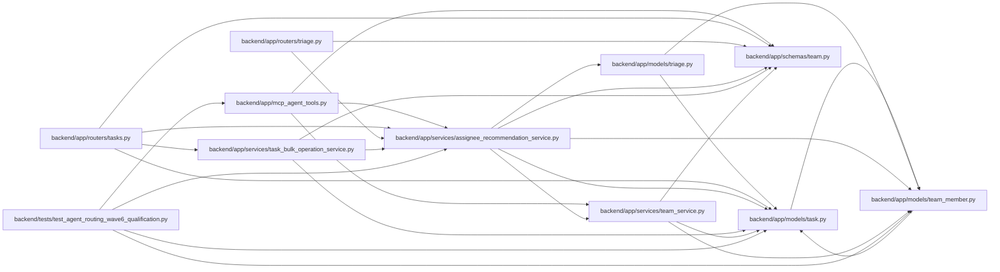

# assignee_recommendation_service Module

**Path:** `backend/app/services/assignee_recommendation_service.py`

## Description

Explainable assignee recommendations from team capability profiles.

## Imports

| Source | Symbols |
|--------|---------|
| `app.models.task` | `Task` |
| `app.models.team_member` | `TeamMember`, `TeamMemberProfile`, `TeamMemberProfileSkill` |
| `app.models.triage` | `TriageClassificationSuggestion`, `TriageItem` |
| `app.schemas.team` | `AssigneeRecommendationResponse` |
| `app.services.team_service` | `TeamService` |
| `dataclasses` | `dataclass` |
| `datetime` | `date` |
| `json` | `json` |
| `re` | `re` |
| `sqlalchemy` | `select` |
| `sqlalchemy.ext.asyncio` | `AsyncSession` |
| `sqlalchemy.orm` | `selectinload` |
| `typing` | `Any`, `Optional`, `Sequence` |

## Local dependency map

<!-- Auto-generated local dependency summary. Do not edit by hand. -->

### Internal neighbors

| Direction | Module |
|---|---|
| Inbound | [mcp_agent_tools](../modules/mcp_agent_tools.md) |
| Inbound | [tasks](../modules/tasks.md) |
| Inbound | [routers_triage](../modules/routers_triage.md) |
| Inbound | [task_bulk_operation_service](../modules/task_bulk_operation_service.md) |
| Inbound | [test_agent_routing_wave6_qualification](../modules/test_agent_routing_wave6_qualification.md) |
| Outbound | [models_task](../modules/models_task.md) |
| Outbound | [team_member](../modules/team_member.md) |
| Outbound | [models_triage](../modules/models_triage.md) |
| Outbound | [schemas_team](../modules/schemas_team.md) |
| Outbound | [team_service](../modules/team_service.md) |

### External packages

| Language | Used packages | Undeclared packages |
|---|---:|---:|
| python | 1 | 0 |

## Classes

| Class | Line | Bases | Description |
|-------|------|-------|-------------|
| [RecommendationContext](../entities/RecommendationContext.md) | 23 | — | Normalized work item context for assignee recommendation scoring. |
| [AssigneeRecommendationService](../entities/AssigneeRecommendationService.md) | 38 | — | Rank iteration team members for task and triage assignment. |
