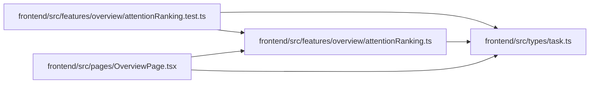

# attentionRanking Module

**Path:** `frontend/src/features/overview/attentionRanking.ts`

## Description

_Auto-generated from `frontend/src/features/overview/attentionRanking.ts`._

## Imports

| Source | Symbols |
|--------|---------|
| `../../types/task` | `Task` |

## Module Signals

| Signal | Values |
|--------|--------|
| Exports | `AttentionKind`, `AttentionSeverity`, `RankableAttention`, `compareAttentionRank`, `rankAttentionItems`, `rankAttentionTaskCandidates` |
| Constants | `severityRank`, `kindTieBreaker` |

## Local dependency map

<!-- Auto-generated local dependency summary. Do not edit by hand. -->

### Internal neighbors

| Direction | Module |
|---|---|
| Inbound | [attentionRanking.test](../modules/attentionRanking.test.md) |
| Inbound | [OverviewPage](../modules/OverviewPage.md) |
| Outbound | [types_task](../modules/types_task.md) |

## Classes

| Class | Kind | Line | Bases / Target | Description |
|-------|------|------|----------------|-------------|
| [AttentionSeverity](../entities/AttentionSeverity.md) | Type alias | 3 | — | — |
| [AttentionKind](../entities/AttentionKind.md) | Type alias | 5 | — | — |
| [RankableAttention](../entities/RankableAttention.md) | Type alias | 13 | — | — |

## Functions

| Function | Signature | Decorators | Description |
|----------|-----------|------------|-------------|
| `compareAttentionRank` | `(left: RankableAttention, right: RankableAttention)` | — | — |
| `rankAttentionItems` | `(items: readonly Item[])` | — | — |
| `rankAttentionTaskCandidates` | `(tasks: readonly Task[])` | — | — |
