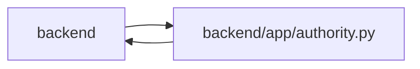

# authority Module

**Path:** `backend/app/authority.py`

## Description

Principal-bound authorization shared by transport adapters and ORM commands.

Managed authority combines a durable principal, workspace/project roles, and actor scopes. ORM reads constrain related records and writes require the relevant action; review is distinct from execution. Trusted-local collaboration is an explicit deployment mode. Narrow internal identity resolution and verified system integrations are server-owned boundaries, not caller-provided identity claims.

Principal-bound policy scopes task, project, backlog and triage reads/writes across transport adapters and ORM operations. Human ownership IDs never authenticate a caller. Narrow protocol bookkeeping permissions cover an actor’s own runs, assignments, claims and idempotency records; verifier rework uses a server-owned review marker. Triage command scope is carried into its event/outbox records without granting workspace access.

Deletion fences are internal recovery metadata and are excluded from ordinary managed principal-scoped ORM reads. Authorized recovery performs its narrowly scoped fence lookup through the internal authority boundary.

## Imports

| Source | Symbols |
|--------|---------|
| `app.config` | `get_settings` |
| `app.database` | `Base`, `Base`, `Base` |
| `app.models.agent` | `AgentTaskAssignment` |
| `app.models.identity` | `CommandAudit`, `CommandAudit` |
| `app.models.task` | `Task` |
| `contextlib` | `contextmanager` |
| `dataclasses` | `dataclass`, `field` |
| `json` | `json` |
| `sqlalchemy` | `and_`, `event`, `false`, `func`, `inspect`, `or_`, `select`, `true` |
| `sqlalchemy.orm` | `Session`, `with_loader_criteria` |
| `sqlalchemy.sql.elements` | `TextClause` |
| `uuid` | `uuid4` |

## Local dependency map

<!-- Auto-generated local dependency summary. Do not edit by hand. -->

> Module-level dependencies exceed the generated-diagram limits, so the diagram and table below group them by top-level package. Counts report the number of module neighbors in each package.

### Internal neighbors

| Direction | Module |
|---|---|
| Inbound | `backend` (29) |
| Outbound | `backend` (5) |

### External packages

| Language | Used packages | Undeclared packages |
|---|---:|---:|
| python | 1 | 0 |

> All 34 module neighbor(s) are summarized by package because the module-level view exceeds the 12-node limit.

## Classes

| Class | Line | Bases | Description |
|-------|------|-------|-------------|
| [AuthorityError](../entities/AuthorityError.md) | 14 | `RuntimeError` | — |
| [Authority](../entities/Authority.md) | 24 | — | — |

## Functions

| Function | Signature | Decorators | Description |
|----------|-----------|------------|-------------|
| `require_project` | `(db, project_id, action = 'read')` | — | — |
| `require_operator` | `(db)` | — | — |
| `internal_authority` | `(db)` | `@contextmanager` | Allow identity resolution or verified automation inside a trusted server boundary. |
| `_scope_conditions` | `(authority)` | — | — |
| `scope_orm_operation` | `(state)` | `@event.listens_for(Session, 'do_orm_execute')` | — |
| `_check_bulk_write` | `(state, authority)` | — | — |
| `_object_project` | `(session, obj)` | — | — |
| `authorize_domain_writes` | `(session, _flush_context, _instances)` | `@event.listens_for(Session, 'before_flush')` | — |
| `append_command_audit` | `(session, _flush_context)` | `@event.listens_for(Session, 'after_flush_postexec')` | — |