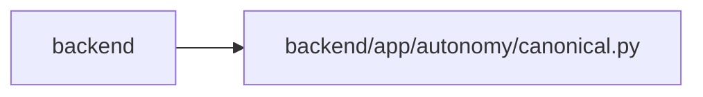

# canonical Module

**Path:** `backend/app/autonomy/canonical.py`

## Description

Canonical serialization and secret-boundary helpers.

## Imports

| Source | Symbols |
|--------|---------|
| `__future__` | `annotations` |
| `collections.abc` | `Mapping`, `Sequence` |
| `datetime` | `date`, `datetime` |
| `enum` | `Enum` |
| `hashlib` | `sha256` |
| `json` | `json` |
| `math` | `math` |
| `pydantic` | `BaseModel`, `ConfigDict` |
| `re` | `re` |
| `typing` | `Any` |

## Local dependency map

<!-- Auto-generated local dependency summary. Do not edit by hand. -->

> Module-level dependencies exceed the generated-diagram limits, so the diagram and table below group them by top-level package. Counts report the number of module neighbors in each package.

### Internal neighbors

| Direction | Module |
|---|---|
| Inbound | `backend` (19) |

### External packages

| Language | Used packages | Undeclared packages |
|---|---:|---:|
| python | 1 | 0 |

> All 19 module neighbor(s) are summarized by package because the module-level view exceeds the 12-node limit.

## Classes

| Class | Line | Bases | Description |
|-------|------|-------|-------------|
| [StrictContractModel](../entities/StrictContractModel.md) | 22 | `BaseModel` | Base class shared by immutable, extra-forbidden contracts. |
| [SecretMaterialError](../entities/SecretMaterialError.md) | 102 | `ValueError` | Raised when a portable/evidence contract contains credential material. |

## Functions

| Function | Signature | Decorators | Description |
|----------|-----------|------------|-------------|
| `_json_value` | `(value: Any) -> Any` | — | — |
| `canonical_json_bytes` | `(value: Any) -> bytes` | — | Serialize one contract using stable UTF-8 JSON bytes. |
| `sha256_hex` | `(value: bytes \| str \| Any) -> str` | — | Return a lowercase SHA-256 digest for bytes, text, or canonical data. |
| `ensure_secret_free` | `(value: Any) -> None` | — | Reject credential-shaped fields/values and pathological contract sizes. |
