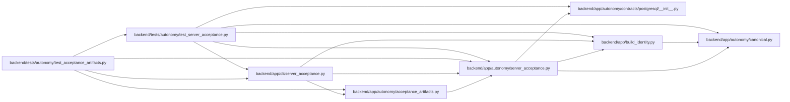

# server_acceptance Module

**Path:** `backend/app/autonomy/server_acceptance.py`

## Description

Container-backed acceptance for a self-hosted WorkChord server.

This module is intentionally separate from ``AutonomousEvidence`` and the
PostgreSQL G1-G15 status evaluator.  A receipt proves only that one exact
checkout ran with the bundled non-production service analogues.

## Imports

| Source | Symbols |
|--------|---------|
| `__future__` | `annotations` |
| `app.autonomy.canonical` | `StrictContractModel`, `canonical_json_bytes`, `ensure_secret_free`, `sha256_hex` |
| `app.autonomy.contracts.postgresql` | `load_postgresql_contract_bundle` |
| `app.build_identity` | `BackendBuildIdentity`, `BuildIdentity`, `load_backend_build_identity` |
| `base64` | `base64` |
| `binascii` | `Error` |
| `cryptography.exceptions` | `InvalidSignature` |
| `cryptography.hazmat.primitives.asymmetric.ed25519` | `Ed25519PublicKey` |
| `dataclasses` | `dataclass` |
| `datetime` | `UTC`, `datetime`, `timedelta` |
| `hashlib` | `sha256` |
| `hmac` | `hmac` |
| `httpx` | `httpx` |
| `pydantic` | `Field`, `model_validator` |
| `socket` | `socket` |
| `typing` | `BinaryIO`, `Literal` |
| `urllib.parse` | `quote`, `urlsplit` |

## Local dependency map

<!-- Auto-generated local dependency summary. Do not edit by hand. -->

### Internal neighbors

| Direction | Module |
|---|---|
| Inbound | [acceptance_artifacts](../modules/acceptance_artifacts.md) |
| Inbound | [cli_server_acceptance](../modules/cli_server_acceptance.md) |
| Inbound | [test_acceptance_artifacts](../modules/test_acceptance_artifacts.md) |
| Inbound | [test_server_acceptance](../modules/test_server_acceptance.md) |
| Outbound | [autonomy_canonical](../modules/autonomy_canonical.md) |
| Outbound | [postgresql___init__](../modules/postgresql___init__.md) |
| Outbound | [build_identity](../modules/build_identity.md) |

### External packages

| Language | Used packages | Undeclared packages |
|---|---:|---:|
| python | 3 | 0 |

## Classes

| Class | Line | Bases | Description |
|-------|------|-------|-------------|
| [ServerAcceptanceError](../entities/ServerAcceptanceError.md) | 43 | `RuntimeError` | A sanitized, stable failure from one server-acceptance predicate. |
| [ApplicationAcceptance](../entities/ApplicationAcceptance.md) | 52 | `StrictContractModel` | — |
| [TransitSignerAcceptance](../entities/TransitSignerAcceptance.md) | 81 | `StrictContractModel` | — |
| [ObjectStoreAcceptance](../entities/ObjectStoreAcceptance.md) | 108 | `StrictContractModel` | — |
| [CasAcceptance](../entities/CasAcceptance.md) | 115 | `StrictContractModel` | — |
| [ServerAcceptanceCandidate](../entities/ServerAcceptanceCandidate.md) | 126 | `StrictContractModel` | — |
| [LockedAcceptanceObject](../entities/LockedAcceptanceObject.md) | 172 | `StrictContractModel` | — |
| [ServerAcceptanceReceipt](../entities/ServerAcceptanceReceipt.md) | 191 | `StrictContractModel` | — |
| [BlockedServerAcceptance](../entities/BlockedServerAcceptance.md) | 260 | `StrictContractModel` | — |
| [ServerAcceptanceConfig](../entities/ServerAcceptanceConfig.md) | 289 | — | Runtime inputs, including credentials that never enter a receipt. |
| [OpenBaoTransitClient](../entities/OpenBaoTransitClient.md) | 309 | — | Small HTTP adapter for the OpenBao/Vault-compatible Transit API. |
| [S3ObjectLockClient](../entities/S3ObjectLockClient.md) | 459 | — | Path-style S3 client with only the operations required by acceptance. |
| [ValkeyCasClient](../entities/ValkeyCasClient.md) | 666 | — | Minimal RESP2 client for the bounded persistent CAS acceptance check. |

## Functions

| Function | Signature | Decorators | Description |
|----------|-----------|------------|-------------|
| `run_server_acceptance` | `(config: ServerAcceptanceConfig, *, evaluated_at: datetime \| None = None) -> ServerAcceptanceReceipt` | — | Run the bounded self-hosted acceptance predicates and seal the report. |
| `build_blocked_result` | `(*, source_revision: str, error: ServerAcceptanceError, evaluated_at: datetime \| None = None) -> BlockedServerAcceptance` | — | — |
| `_probe_application` | `(backend_url: str, *, gateway_url: str, expected_source_revision: str, timeout_seconds: float) -> ApplicationAcceptance` | — | — |
| `_signed_report_payload` | `(candidate: ServerAcceptanceCandidate, signature: str) -> bytes` | — | — |
| `_verify_transit_signature` | `(signer: TransitSignerAcceptance, payload: bytes, signature: str) -> None` | — | — |
| `verify_receipt_trusted_signer` | `(receipt: ServerAcceptanceReceipt, trusted_public_key_base64: str) -> None` | — | Bind a self-contained receipt to a public key supplied out of band. |
| `verify_receipt_current_build` | `(receipt: ServerAcceptanceReceipt, build_identity: BackendBuildIdentity, *, verified_at: datetime \| None = None) -> None` | — | Require an unexpired receipt for the verifier's exact baked artifacts. |
| `_decode_ed25519_public_key` | `(value: str, *, error_message: str) -> bytes` | — | — |
| `_aws_signing_key` | `(secret_key: str, *, date_stamp: str, region: str, service: str) -> bytes` | — | — |
| `_valkey_command` | `(stream: BinaryIO, *parts: str) -> object` | — | — |
| `_read_resp` | `(stream: BinaryIO) -> object` | — | — |
| `_is_hex_revision` | `(value: str) -> bool` | — | — |
