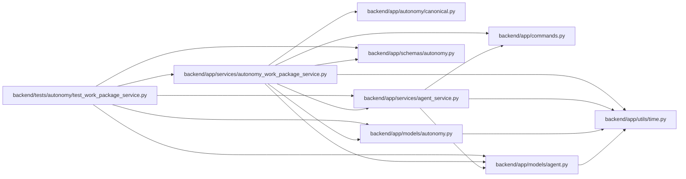

# autonomy_work_package_service Module

**Path:** `backend/app/services/autonomy_work_package_service.py`

## Description

Fenced, package-level autonomous verification lifecycle service.

## Imports

| Source | Symbols |
|--------|---------|
| `__future__` | `annotations` |
| `app.autonomy.canonical` | `sha256_hex` |
| `app.commands` | `commit_or_flush` |
| `app.models.agent` | `AgentActor` |
| `app.models.autonomy` | `AgentAutonomyTopology`, `AgentAutonomyTopologyMember`, `AgentVerificationEvent`, `AgentVerificationRequirement`, `AgentWorkPackage` |
| `app.schemas.autonomy` | `AgentWorkPackageCreate`, `AgentWorkPackageResponse`, `ResolvedVerifierLease`, `VerificationBeginRequest`, `VerificationClaimRequest`, `VerificationRenewRequest`, `VerificationRequirementResponse`, `VerificationSubmitRequest`, `VerificationTransitionResponse` |
| `app.services.agent_service` | `AgentConflictError`, `AgentPermissionError`, `actor_has_scope`, `validate_idempotency_key` |
| `app.utils.time` | `as_utc`, `utc_now` |
| `datetime` | `datetime` |
| `sqlalchemy` | `select` |
| `sqlalchemy.ext.asyncio` | `AsyncSession` |
| `sqlalchemy.orm` | `selectinload` |
| `typing` | `Any` |

## Local dependency map

<!-- Auto-generated local dependency summary. Do not edit by hand. -->

### Internal neighbors

| Direction | Module |
|---|---|
| Inbound | [test_work_package_service](../modules/test_work_package_service.md) |
| Outbound | [autonomy_canonical](../modules/autonomy_canonical.md) |
| Outbound | [commands](../modules/commands.md) |
| Outbound | [models_agent](../modules/models_agent.md) |
| Outbound | [models_autonomy](../modules/models_autonomy.md) |
| Outbound | [schemas_autonomy](../modules/schemas_autonomy.md) |
| Outbound | [agent_service](../modules/agent_service.md) |
| Outbound | [time](../modules/time.md) |

### External packages

| Language | Used packages | Undeclared packages |
|---|---:|---:|
| python | 1 | 0 |

## Classes

| Class | Line | Bases | Description |
|-------|------|-------|-------------|
| [AutonomyWorkPackageService](../entities/AutonomyWorkPackageService.md) | 46 | — | Mirror external-journal decisions without letting Task.status accept work. |
