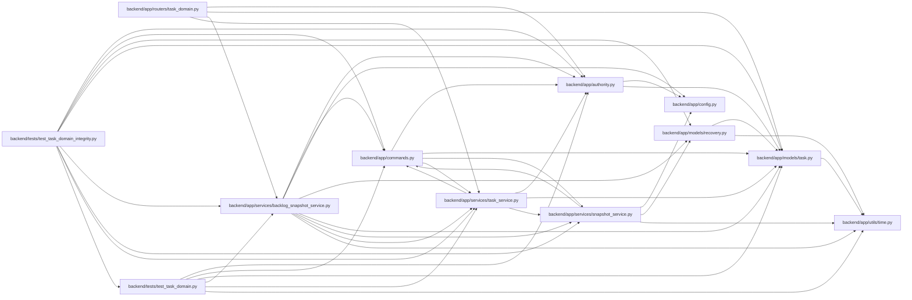

# backlog_snapshot_service Module

**Path:** `backend/app/services/backlog_snapshot_service.py`

## Description

Project backlog recovery using the shared transactional snapshot store.

Project backlog recovery uses the shared database snapshot store and the command transaction. Captures are bounded, checksummed and retained per project. Restore checks the complete current task-version map, preserves IDs and immutable brief history, and clears current acceptance/progress. Project authority and dependency scope remain validated.

Scheduled and backlog restoration share a version allocator under the owning scope lock. It advances above the saved version, live task, retained history and durable deletion fence. Current progress and acceptance are cleared; immutable history survives. A deleted task without a reliable deletion fence returns snapshot_version_history_unknown (409), requiring recovery from a complete matching database backup.

## Imports

| Source | Symbols |
|--------|---------|
| `app.authority` | `AuthorityError`, `internal_authority`, `require_project` |
| `app.commands` | `atomic_command`, `current_command`, `lock_backlog_project` |
| `app.config` | `get_settings` |
| `app.models.recovery` | `ApplicationSnapshot` |
| `app.models.task` | `Task`, `TaskDependency` |
| `app.services.snapshot_service` | `SnapshotService` |
| `app.services.task_service` | `TaskService` |
| `app.utils.time` | `utc_now` |
| `datetime` | `date`, `datetime` |
| `hashlib` | `hashlib` |
| `json` | `json` |
| `sqlalchemy` | `delete`, `or_`, `select` |

## Local dependency map

<!-- Auto-generated local dependency summary. Do not edit by hand. -->

### Internal neighbors

| Direction | Module |
|---|---|
| Inbound | [routers_task_domain](../modules/routers_task_domain.md) |
| Inbound | [test_task_domain](../modules/test_task_domain.md) |
| Inbound | [test_task_domain_integrity](../modules/test_task_domain_integrity.md) |
| Outbound | [authority](../modules/authority.md) |
| Outbound | [commands](../modules/commands.md) |
| Outbound | [config](../modules/config.md) |
| Outbound | [recovery](../modules/recovery.md) |
| Outbound | [models_task](../modules/models_task.md) |
| Outbound | [snapshot_service](../modules/snapshot_service.md) |
| Outbound | [task_service](../modules/task_service.md) |
| Outbound | [time](../modules/time.md) |

### External packages

| Language | Used packages | Undeclared packages |
|---|---:|---:|
| python | 1 | 0 |

## Classes

| Class | Line | Bases | Description |
|-------|------|-------|-------------|
| [BacklogSnapshotService](../entities/BacklogSnapshotService.md) | 19 | — | — |