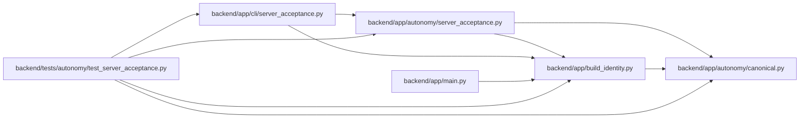

# build_identity Module

**Path:** `backend/app/build_identity.py`

## Description

Revision-bound identity baked into WorkChord container images.

## Imports

| Source | Symbols |
|--------|---------|
| `__future__` | `annotations` |
| `app.autonomy.canonical` | `StrictContractModel` |
| `argparse` | `argparse` |
| `hashlib` | `sha256` |
| `json` | `json` |
| `pathlib` | `Path` |
| `pydantic` | `Field` |
| `typing` | `Literal` |

## Local dependency map

<!-- Auto-generated local dependency summary. Do not edit by hand. -->

### Internal neighbors

| Direction | Module |
|---|---|
| Inbound | [autonomy_server_acceptance](../modules/autonomy_server_acceptance.md) |
| Inbound | [cli_server_acceptance](../modules/cli_server_acceptance.md) |
| Inbound | [app_main](../modules/app_main.md) |
| Inbound | [test_server_acceptance](../modules/test_server_acceptance.md) |
| Outbound | [autonomy_canonical](../modules/autonomy_canonical.md) |

### External packages

| Language | Used packages | Undeclared packages |
|---|---:|---:|
| python | 1 | 0 |

## Classes

| Class | Line | Bases | Description |
|-------|------|-------|-------------|
| [BuildIdentity](../entities/BuildIdentity.md) | 21 | `StrictContractModel` | Content identity written while an image is built. |
| [BackendBuildIdentity](../entities/BackendBuildIdentity.md) | 32 | `BuildIdentity` | Backend package identity plus its independently built gateway digest. |

## Functions

| Function | Signature | Decorators | Description |
|----------|-----------|------------|-------------|
| `load_backend_build_identity` | `(path: Path = BUILD_IDENTITY_PATH) -> BackendBuildIdentity` | — | Read the backend image identity from its fixed filesystem location. |
| `package_artifact_digest` | `(package_root: Path) -> str` | — | Hash stable package paths and bytes, excluding interpreter caches. |
| `_parse_args` | `() -> argparse.Namespace` | — | — |
| `main` | `() -> int` | — | — |
