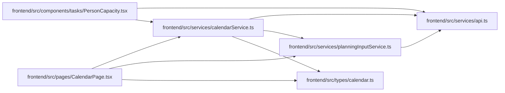

# calendarService Module

**Path:** `frontend/src/services/calendarService.ts`

## Description

_Auto-generated from `frontend/src/services/calendarService.ts`._

## Imports

| Source | Symbols |
|--------|---------|
| `../types/calendar` | `Calendar`, `CalendarCreate`, `CalendarImportResponse`, `CalendarUpdate`, `WorkingDaysResponse` |
| `./api` | `api` |
| `./planningInputService` | `revisionHeaders`, `ObservedRevisions` |

## Module Signals

| Signal | Values |
|--------|--------|
| Exports | `calendarService` |
| Constants | `calendarService` |

## Local dependency map

<!-- Auto-generated local dependency summary. Do not edit by hand. -->

### Internal neighbors

| Direction | Module |
|---|---|
| Inbound | [PersonCapacity](../modules/PersonCapacity.md) |
| Inbound | [CalendarPage](../modules/CalendarPage.md) |
| Outbound | [api](../modules/api.md) |
| Outbound | [planningInputService](../modules/planningInputService.md) |
| Outbound | [types_calendar](../modules/types_calendar.md) |
