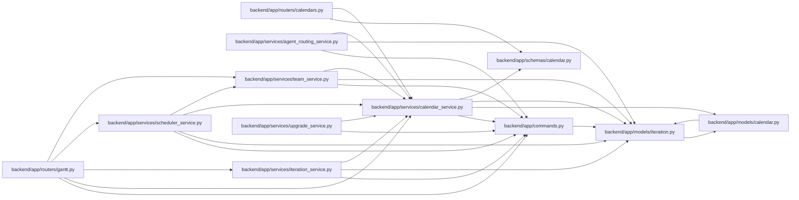

# calendar_service Module

**Path:** `backend/app/services/calendar_service.py`

## Description

Calendar service with business logic.

## Imports

| Source | Symbols |
|--------|---------|
| `app.commands` | `commit_or_flush`, `schedule_input_command` |
| `app.models.calendar` | `Calendar` |
| `app.models.iteration` | `Iteration` |
| `app.schemas.calendar` | `CalendarCreate`, `CalendarImportError`, `CalendarImportRequest`, `CalendarImportResponse`, `CalendarUpdate`, `WorkingDaysResponse` |
| `collections.abc` | `Iterable` |
| `csv` | `csv` |
| `datetime` | `date`, `timedelta` |
| `io` | `StringIO` |
| `sqlalchemy` | `func`, `select` |
| `sqlalchemy.ext.asyncio` | `AsyncSession` |
| `typing` | `Sequence` |

## Local dependency map

<!-- Auto-generated local dependency summary. Do not edit by hand. -->

### Internal neighbors

| Direction | Module |
|---|---|
| Inbound | [calendars](../modules/calendars.md) |
| Inbound | [routers_gantt](../modules/routers_gantt.md) |
| Inbound | [agent_routing_service](../modules/agent_routing_service.md) |
| Inbound | [iteration_service](../modules/iteration_service.md) |
| Inbound | [scheduler_service](../modules/scheduler_service.md) |
| Inbound | [team_service](../modules/team_service.md) |
| Inbound | [upgrade_service](../modules/upgrade_service.md) |
| Outbound | [commands](../modules/commands.md) |
| Outbound | [models_calendar](../modules/models_calendar.md) |
| Outbound | [models_iteration](../modules/models_iteration.md) |
| Outbound | [schemas_calendar](../modules/schemas_calendar.md) |

### External packages

| Language | Used packages | Undeclared packages |
|---|---:|---:|
| python | 1 | 0 |

## Classes

| Class | Line | Bases | Description |
|-------|------|-------|-------------|
| [CalendarService](../entities/CalendarService.md) | 64 | — | Service for calendar operations. |
