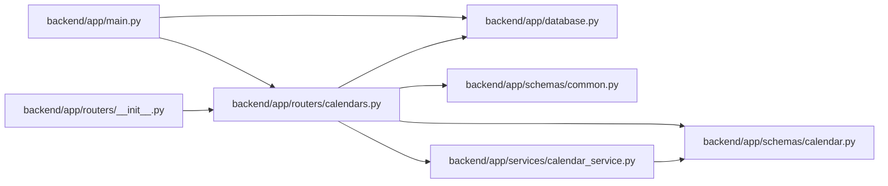

# calendars Module

**Path:** `backend/app/routers/calendars.py`

## Description

Calendar API router.

## Imports

| Source | Symbols |
|--------|---------|
| `app.database` | `get_db` |
| `app.schemas.calendar` | `CalendarCreate`, `CalendarUpdate`, `CalendarResponse`, `CalendarImportRequest`, `CalendarImportResponse`, `WorkingDaysRequest`, `WorkingDaysResponse` |
| `app.schemas.common` | `MessageResponse` |
| `app.services.calendar_service` | `CalendarService` |
| `datetime` | `date` |
| `fastapi` | `APIRouter`, `Depends`, `HTTPException`, `Query`, `status` |
| `sqlalchemy.ext.asyncio` | `AsyncSession` |
| `typing` | `Annotated` |

## Local dependency map

<!-- Auto-generated local dependency summary. Do not edit by hand. -->

### Internal neighbors

| Direction | Module |
|---|---|
| Inbound | [app_main](../modules/app_main.md) |
| Inbound | [routers___init__](../modules/routers___init__.md) |
| Outbound | [app_database](../modules/app_database.md) |
| Outbound | [schemas_calendar](../modules/schemas_calendar.md) |
| Outbound | [schemas_common](../modules/schemas_common.md) |
| Outbound | [calendar_service](../modules/calendar_service.md) |

### External packages

| Language | Used packages | Undeclared packages |
|---|---:|---:|
| python | 2 | 0 |

## Functions

| Function | Signature | Decorators | Description |
|----------|-----------|------------|-------------|
| `get_calendar_service` | *(async)* `(db: Annotated[AsyncSession, Depends(get_db, scope='function')]) -> CalendarService` | — | Dependency for calendar service. |
| `get_calendars` | *(async)* `(service: Annotated[CalendarService, Depends(get_calendar_service)])` | `@router.get('/calendars', response_model=list[CalendarResponse])` | Get all calendars. |
| `create_calendar` | *(async)* `(data: CalendarCreate, service: Annotated[CalendarService, Depends(get_calendar_service)])` | `@router.post('/calendars', response_model=CalendarResponse, status_code=status.HTTP_201_CREATED)` | Create a new calendar. |
| `get_calendar` | *(async)* `(calendar_id: int, service: Annotated[CalendarService, Depends(get_calendar_service)])` | `@router.get('/calendars/{calendar_id}', response_model=CalendarResponse)` | Get calendar by ID. |
| `update_calendar` | *(async)* `(calendar_id: int, data: CalendarUpdate, service: Annotated[CalendarService, Depends(get_calendar_service)])` | `@router.put('/calendars/{calendar_id}', response_model=CalendarResponse)` | Update a calendar. |
| `delete_calendar` | *(async)* `(calendar_id: int, service: Annotated[CalendarService, Depends(get_calendar_service)])` | `@router.delete('/calendars/{calendar_id}', response_model=MessageResponse)` | Delete a calendar. |
| `import_calendar_holidays` | *(async)* `(calendar_id: int, data: CalendarImportRequest, service: Annotated[CalendarService, Depends(get_calendar_service)])` | `@router.post('/calendars/{calendar_id}/import-holidays', response_model=CalendarImportResponse)` | Import holidays into a calendar from public data or CSV rows. |
| `get_working_days` | *(async)* `(calendar_id: int, start_date: Annotated[date, Query(description='Start date (ISO format)')], end_date: Annotated[date, Query(description='End date (ISO format)')], service: Annotated[CalendarService, Depends(get_calendar_service)])` | `@router.get('/calendars/{calendar_id}/working-days', response_model=WorkingDaysResponse)` | Calculate working days for a period. |
