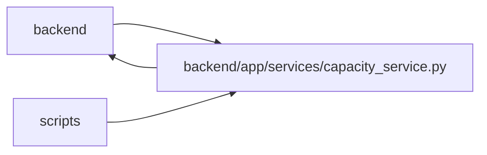

# capacity_service Module

**Path:** `backend/app/services/capacity_service.py`

## Description

Owns versioned person calendar and absence commands, date-based capacity projections, and commitment constraints. Managed edits require the linked human or an operator; trusted-local mode retains its explicit open boundary. Absence unions, calendar hours, allocation, utilization and coefficients are applied once. Private allocations contribute aggregate busy time only. Unknown effort and calendar coverage remain explicit; commitments require linked profiles, sufficient capacity and allocation date coverage.

Commitment projections select only required scalar task fields after complete scoped ancestry validation. Shared capacity conflicts remain aggregate constraints and never serialize private work or absence details.

## Imports

| Source | Symbols |
|--------|---------|
| `app.authority` | `AuthorityError`, `internal_authority` |
| `app.commands` | `PlanningConflict`, `atomic_command`, `lock_iterations`, `lock_planning` |
| `app.models.calendar` | `Calendar` |
| `app.models.capacity` | `PlanningState`, `ProfileAbsence`, `ProfileAvailability` |
| `app.models.iteration` | `Iteration` |
| `app.models.team_member` | `TeamMember`, `TeamMemberProfile`, `Vacation` |
| `datetime` | `date`, `timedelta` |
| `sqlalchemy` | `delete`, `select`, `update` |

## Local dependency map

<!-- Auto-generated local dependency summary. Do not edit by hand. -->

> Module-level dependencies exceed the generated-diagram limits, so the diagram and table below group them by top-level package. Counts report the number of module neighbors in each package.

### Internal neighbors

| Direction | Module |
|---|---|
| Inbound | `backend` (5) |
| Inbound | `scripts` (1) |
| Outbound | `backend` (6) |

### External packages

| Language | Used packages | Undeclared packages |
|---|---:|---:|
| python | 1 | 0 |

> All 12 module neighbor(s) are summarized by package because the module-level view exceeds the 12-node limit.

## Classes

| Class | Line | Bases | Description |
|-------|------|-------|-------------|
| [CapacityService](../entities/CapacityService.md) | 27 | — | — |

## Functions

| Function | Signature | Decorators | Description |
|----------|-----------|------------|-------------|
| `day_hours` | `(calendar, day)` | — | Nominal local-date hours, with each holiday/weekend/short-day rule applied once. |
| `calendar_signature` | `(calendar)` | — | — |