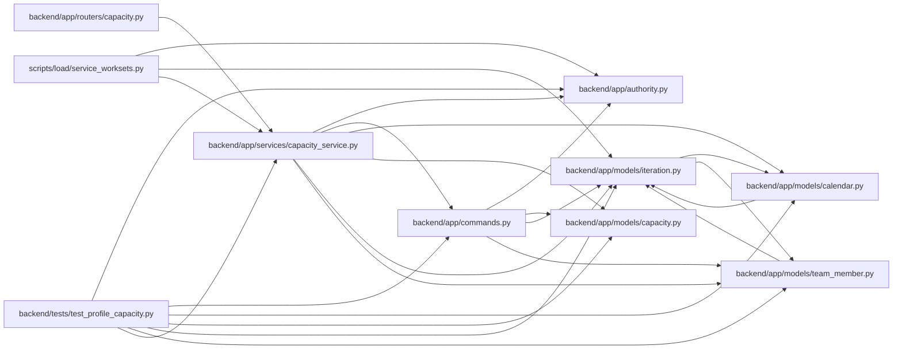

# capacity_service Module

**Path:** `backend/app/services/capacity_service.py`

## Description

Owns versioned person calendar and absence commands, date-based capacity projections, and commitment constraints. Managed edits require the linked human or an operator; trusted-local mode retains its explicit open boundary. Absence unions, calendar hours, allocation, utilization and coefficients are applied once. Private allocations contribute aggregate busy time only. Unknown effort and calendar coverage remain explicit; commitments require linked profiles, sufficient capacity and allocation date coverage.

## Imports

| Source | Symbols |
|--------|---------|
| `app.authority` | `AuthorityError`, `internal_authority` |
| `app.commands` | `PlanningConflict`, `atomic_command`, `lock_iterations`, `lock_planning` |
| `app.models.calendar` | `Calendar` |
| `app.models.capacity` | `PlanningState`, `ProfileAbsence`, `ProfileAvailability` |
| `app.models.iteration` | `Iteration` |
| `app.models.team_member` | `TeamMember`, `TeamMemberProfile`, `Vacation` |
| `datetime` | `date`, `timedelta` |
| `sqlalchemy` | `delete`, `select`, `update` |

## Local dependency map

<!-- Auto-generated local dependency summary. Do not edit by hand. -->

### Internal neighbors

| Direction | Module |
|---|---|
| Inbound | [routers_capacity](../modules/routers_capacity.md) |
| Inbound | [test_profile_capacity](../modules/test_profile_capacity.md) |
| Inbound | [service_worksets](../modules/service_worksets.md) |
| Outbound | [authority](../modules/authority.md) |
| Outbound | [commands](../modules/commands.md) |
| Outbound | [models_calendar](../modules/models_calendar.md) |
| Outbound | [models_capacity](../modules/models_capacity.md) |
| Outbound | [models_iteration](../modules/models_iteration.md) |
| Outbound | [team_member](../modules/team_member.md) |

### External packages

| Language | Used packages | Undeclared packages |
|---|---:|---:|
| python | 1 | 0 |

## Classes

| Class | Line | Bases | Description |
|-------|------|-------|-------------|
| [CapacityService](../entities/CapacityService.md) | 27 | — | — |

## Functions

| Function | Signature | Decorators | Description |
|----------|-----------|------------|-------------|
| `day_hours` | `(calendar, day)` | — | Nominal local-date hours, with each holiday/weekend/short-day rule applied once. |
| `calendar_signature` | `(calendar)` | — | — |