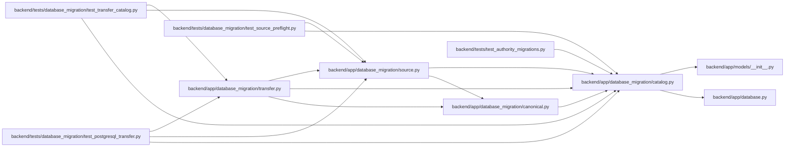

# catalog Module

**Path:** `backend/app/database_migration/catalog.py`

## Description

Derives transfer coverage and ordering from the packaged schema. Nullable references are staged only when aggregate constraints permit it. Task/snapshot scope references and typed delivery targets remain present during insertion, so referenced tasks and milestones load first without disabling constraints.

## Imports

| Source | Symbols |
|--------|---------|
| `__future__` | `annotations` |
| `app` | `models` |
| `app.database` | `Base` |
| `dataclasses` | `dataclass` |
| `sqlalchemy` | `Boolean`, `Date`, `DateTime`, `Float`, `Integer`, `JSON`, `LargeBinary`, `Numeric`, `String` |
| `sqlalchemy.sql.schema` | `Column`, `Table` |
| `sqlalchemy.types` | `TypeDecorator` |
| `typing` | `Literal` |

## Local dependency map

<!-- Auto-generated local dependency summary. Do not edit by hand. -->

### Internal neighbors

| Direction | Module |
|---|---|
| Inbound | [database_migration_canonical](../modules/database_migration_canonical.md) |
| Inbound | [source](../modules/source.md) |
| Inbound | [transfer](../modules/transfer.md) |
| Inbound | [test_postgresql_transfer](../modules/test_postgresql_transfer.md) |
| Inbound | [test_source_preflight](../modules/test_source_preflight.md) |
| Inbound | [test_transfer_catalog](../modules/test_transfer_catalog.md) |
| Inbound | [test_authority_migrations](../modules/test_authority_migrations.md) |
| Outbound | [app_database](../modules/app_database.md) |
| Outbound | [models___init__](../modules/models___init__.md) |

### External packages

| Language | Used packages | Undeclared packages |
|---|---:|---:|
| python | 1 | 0 |

## Classes

| Class | Line | Bases | Description |
|-------|------|-------|-------------|
| [CatalogEntry](../entities/CatalogEntry.md) | 48 | — | — |

## Functions

| Function | Signature | Decorators | Description |
|----------|-----------|------------|-------------|
| `_base_type` | `(column: Column[object]) -> object` | — | — |
| `column_family` | `(column: Column[object]) -> str` | — | Return the conversion family used by canonicalization and loading. |
| `column_max_length` | `(column: Column[object]) -> int \| None` | — | Return the target character limit, including decorated string types. |
| `application_tables` | `() -> dict[str, Table]` | — | — |
| `transfer_tables` | `() -> dict[str, Table]` | — | — |
| `staged_reference_columns` | `(table: Table) -> tuple[str, ...]` | — | Stage nullable references so cycles never weaken target constraints. |
| `transfer_order` | `() -> tuple[str, ...]` | — | Order tables by references that must survive their initial insertion. |
| `catalog_entries` | `() -> tuple[CatalogEntry, ...]` | — | — |
