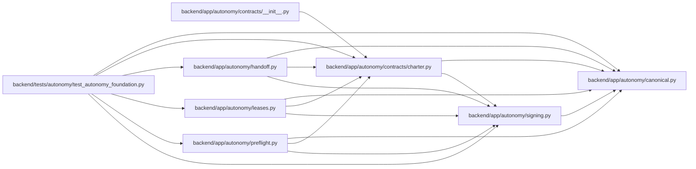

# charter Module

**Path:** `backend/app/autonomy/contracts/charter.py`

## Description

Standing delegation and finite bootstrap-action contracts.

## Imports

| Source | Symbols |
|--------|---------|
| `__future__` | `annotations` |
| `app.autonomy.canonical` | `StrictContractModel`, `canonical_json_bytes`, `ensure_secret_free`, `sha256_hex` |
| `app.autonomy.signing` | `DetachedSignatureEnvelope`, `PublicTrustResolver`, `RemoteSigner`, `SignatureVerificationError`, `verify_detached_signature` |
| `collections.abc` | `Callable` |
| `datetime` | `UTC`, `datetime`, `timedelta` |
| `enum` | `StrEnum` |
| `pydantic` | `Field`, `field_validator`, `model_validator` |
| `typing` | `Literal`, `Protocol`, `runtime_checkable` |

## Local dependency map

<!-- Auto-generated local dependency summary. Do not edit by hand. -->

### Internal neighbors

| Direction | Module |
|---|---|
| Inbound | [contracts___init__](../modules/contracts___init__.md) |
| Inbound | [handoff](../modules/handoff.md) |
| Inbound | [leases](../modules/leases.md) |
| Inbound | [preflight](../modules/preflight.md) |
| Inbound | [test_autonomy_foundation](../modules/test_autonomy_foundation.md) |
| Outbound | [autonomy_canonical](../modules/autonomy_canonical.md) |
| Outbound | [signing](../modules/signing.md) |

### External packages

| Language | Used packages | Undeclared packages |
|---|---:|---:|
| python | 1 | 0 |

## Classes

| Class | Kind | Line | Bases / Target | Description |
|-------|------|------|----------------|-------------|
| [ProgramDecision](../entities/ProgramDecision.md) | Enum | 32 | `StrEnum` | — |
| [AutonomyState](../entities/AutonomyState.md) | Enum | 37 | `StrEnum` | — |
| [ExactResourceBinding](../entities/ExactResourceBinding.md) | Pydantic model | 43 | `StrictContractModel` | One charter-pinned external system/resource generation. |
| [ImmutableInputBinding](../entities/ImmutableInputBinding.md) | Pydantic model | 87 | `StrictContractModel` | — |
| [ExecutionBudget](../entities/ExecutionBudget.md) | Pydantic model | 96 | `StrictContractModel` | — |
| [MigrationPolicy](../entities/MigrationPolicy.md) | Pydantic model | 105 | `StrictContractModel` | — |
| [ExecutionWindow](../entities/ExecutionWindow.md) | Pydantic model | 129 | `StrictContractModel` | — |
| [TrustedKeyBinding](../entities/TrustedKeyBinding.md) | Pydantic model | 146 | `StrictContractModel` | — |
| [AutonomyCharter](../entities/AutonomyCharter.md) | Pydantic model | 154 | `StrictContractModel` | Externally established authority consumed by the autonomous program. |
| [BootstrapActionSlot](../entities/BootstrapActionSlot.md) | Pydantic model | 238 | `StrictContractModel` | One finite externally preissued bootstrap mutation slot. |
| [BootstrapActionManifest](../entities/BootstrapActionManifest.md) | Pydantic model | 271 | `StrictContractModel` | — |
| [SignedAutonomyCharter](../entities/SignedAutonomyCharter.md) | Pydantic model | 299 | `StrictContractModel` | — |
| [SignedBootstrapActionManifest](../entities/SignedBootstrapActionManifest.md) | Pydantic model | 304 | `StrictContractModel` | — |
| [RevocationObservation](../entities/RevocationObservation.md) | Pydantic model | 309 | `StrictContractModel` | Source-derived revocation result; never a caller-authored bare Boolean. |
| [RevocationResolver](../entities/RevocationResolver.md) | Class | 327 | `Protocol` | — |
| [CharterVerificationReceipt](../entities/CharterVerificationReceipt.md) | Pydantic model | 333 | `StrictContractModel` | — |
| [SignedCharterVerificationReceipt](../entities/SignedCharterVerificationReceipt.md) | Pydantic model | 357 | `StrictContractModel` | — |
| [CharterVerificationError](../entities/CharterVerificationError.md) | Class | 362 | `ValueError` | — |
| [CharterVerifier](../entities/CharterVerifier.md) | Class | 366 | — | Verify external authority without creating or broadening it. |

## Functions

| Function | Signature | Decorators | Description |
|----------|-----------|------------|-------------|
| `sign_charter_verification_receipt` | `(receipt: CharterVerificationReceipt, *, signer: RemoteSigner, key_ref: str) -> SignedCharterVerificationReceipt` | — | Sign a deterministic receipt through the external charter-verifier key. |
| `_require_aware` | `(value: datetime, field_name: str) -> None` | — | — |
