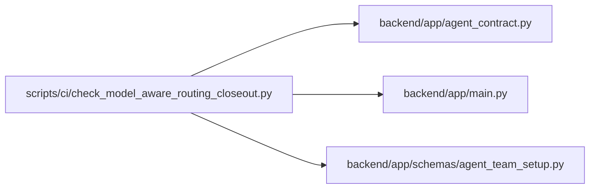

# check_model_aware_routing_closeout Module

**Path:** `scripts/ci/check_model_aware_routing_closeout.py`

## Description

Validate the tracked model-aware routing closure inventory.

Schema evidence in the tracked inventory names the consolidated initial migration and current implementation surfaces. Evidence paths must exist within the repository, and the tracked mode additionally requires Git-index membership. Updating a path does not change the declared completion or external-acceptance state.

## Imports

| Source | Symbols |
|--------|---------|
| `__future__` | `annotations` |
| `app.agent_contract` | `AGENT_TEAM_MASTER_FEATURE`, `MODEL_AWARE_ROUTING_FEATURE`, `agent_contract_features` |
| `app.main` | `app` |
| `app.schemas.agent_team_setup` | `AGENT_TEAM_REPORT_SCHEMA_VERSION`, `AgentTeamMaster` |
| `argparse` | `argparse` |
| `hashlib` | `sha256` |
| `json` | `json` |
| `pathlib` | `Path`, `PurePosixPath` |
| `subprocess` | `subprocess` |
| `sys` | `sys` |
| `tomllib` | `tomllib` |
| `typing` | `Any` |

## Local dependency map

<!-- Auto-generated local dependency summary. Do not edit by hand. -->

### Internal neighbors

| Direction | Module |
|---|---|
| Outbound | [agent_contract](../modules/agent_contract.md) |
| Outbound | [app_main](../modules/app_main.md) |
| Outbound | [agent_team_setup](../modules/agent_team_setup.md) |

### External packages

| Language | Used packages | Undeclared packages |
|---|---:|---:|
| python | 1 | 1 |

## Classes

| Class | Line | Bases | Description |
|-------|------|-------|-------------|
| [CloseoutContractError](../entities/CloseoutContractError.md) | 51 | `RuntimeError` | Raised when closure evidence is incomplete, stale, or overclaimed. |

## Functions

| Function | Signature | Decorators | Description |
|----------|-----------|------------|-------------|
| `parse_args` | `() -> argparse.Namespace` | — | — |
| `_load_json` | `(path: Path) -> dict[str, Any]` | — | — |
| `_exact_ids` | `(entries: Any, *, label: str, expected: set[str], required_status: str) -> tuple[dict[str, Any], ...]` | — | — |
| `_evidence_path` | `(raw_path: str) -> Path` | — | — |
| `_require_tracked` | `(paths: set[str]) -> None` | — | — |
| `_validate_versions` | `(inventory: dict[str, Any]) -> dict[str, str]` | — | — |
| `_validate_master` | `(inventory: dict[str, Any]) -> dict[str, Any]` | — | — |
| `_validate_external_truth` | `(inventory: dict[str, Any]) -> dict[str, Any]` | — | — |
| `validate_closeout` | `(inventory_path: Path, *, require_tracked: bool) -> dict[str, Any]` | — | — |
| `main` | `() -> int` | — | — |
