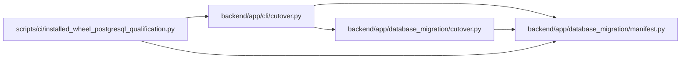

# cutover Module

**Path:** `backend/app/cli/cutover.py`

## Description

Command-line coordinator for signed PostgreSQL cutover evidence.

## Imports

| Source | Symbols |
|--------|---------|
| `__future__` | `annotations` |
| `app.database_migration.cutover` | `CutoverEvidenceError`, `attest_documentation`, `authorize_production`, `finalize_production`, `finalize_rehearsal`, `finalize_rehearsal_series`, `seal_execution`, `verify_report` |
| `app.database_migration.manifest` | `ManifestError` |
| `argparse` | `argparse` |
| `pathlib` | `Path` |
| `sys` | `sys` |

## Local dependency map

<!-- Auto-generated local dependency summary. Do not edit by hand. -->

### Internal neighbors

| Direction | Module |
|---|---|
| Inbound | [installed_wheel_postgresql_qualification](../modules/installed_wheel_postgresql_qualification.md) |
| Outbound | [database_migration_cutover](../modules/database_migration_cutover.md) |
| Outbound | [database_migration_manifest](../modules/database_migration_manifest.md) |

## Functions

| Function | Signature | Decorators | Description |
|----------|-----------|------------|-------------|
| `_trusted_dependency_arguments` | `(parser: argparse.ArgumentParser) -> None` | — | — |
| `_signing_arguments` | `(parser: argparse.ArgumentParser) -> None` | — | — |
| `build_parser` | `() -> argparse.ArgumentParser` | — | — |
| `main` | `(argv: list[str] \| None = None) -> int` | — | — |
