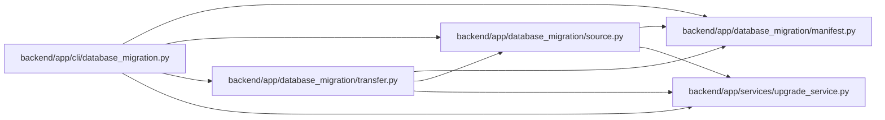

# database_migration Module

**Path:** `backend/app/cli/database_migration.py`

## Description

Operational SQLite-to-PostgreSQL migration command.

## Imports

| Source | Symbols |
|--------|---------|
| `__future__` | `annotations` |
| `app.database_migration.manifest` | `ManifestError`, `write_document` |
| `app.database_migration.source` | `MigrationDataError`, `preflight_source` |
| `app.database_migration.transfer` | `load_snapshot`, `reconcile_snapshot`, `record_post_copy_repairs`, `target_identifier` |
| `app.services.upgrade_service` | `database_configuration` |
| `argparse` | `argparse` |
| `json` | `json` |
| `pathlib` | `Path` |
| `sys` | `sys` |

## Local dependency map

<!-- Auto-generated local dependency summary. Do not edit by hand. -->

### Internal neighbors

| Direction | Module |
|---|---|
| Outbound | [database_migration_manifest](../modules/database_migration_manifest.md) |
| Outbound | [source](../modules/source.md) |
| Outbound | [transfer](../modules/transfer.md) |
| Outbound | [upgrade_service](../modules/upgrade_service.md) |

## Functions

| Function | Signature | Decorators | Description |
|----------|-----------|------------|-------------|
| `build_parser` | `() -> argparse.ArgumentParser` | — | — |
| `_seal` | `(input_path: Path, output_path: Path) -> dict[str, object]` | — | — |
| `main` | `(argv: list[str] \| None = None) -> int` | — | — |
