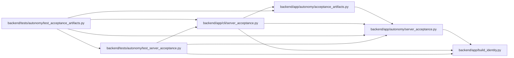

# server_acceptance Module

**Path:** `backend/app/cli/server_acceptance.py`

## Description

Runs container-backed self-hosted acceptance or mutually exclusive offline receipt/archive verification. Archive verification consumes an independently supplied public-key pin, checks exact exported bytes and candidate identities, and requires a valid latest receipt matching the installed build. Invalid artifacts produce a sanitized unsuccessful decision. Successful verification retains the signed non-production boundary and does not qualify production autonomy.

## Imports

| Source | Symbols |
|--------|---------|
| `__future__` | `annotations` |
| `app.autonomy.acceptance_artifacts` | `verify_exported_artifacts` |
| `app.autonomy.server_acceptance` | `ServerAcceptanceConfig`, `ServerAcceptanceError`, `ServerAcceptanceReceipt`, `build_blocked_result`, `run_server_acceptance`, `verify_receipt_current_build`, `verify_receipt_trusted_signer` |
| `app.build_identity` | `load_backend_build_identity` |
| `argparse` | `argparse` |
| `json` | `json` |
| `os` | `os` |
| `pathlib` | `Path` |
| `tempfile` | `tempfile` |

## Local dependency map

<!-- Auto-generated local dependency summary. Do not edit by hand. -->

### Internal neighbors

| Direction | Module |
|---|---|
| Inbound | [test_acceptance_artifacts](../modules/test_acceptance_artifacts.md) |
| Inbound | [test_server_acceptance](../modules/test_server_acceptance.md) |
| Outbound | [acceptance_artifacts](../modules/acceptance_artifacts.md) |
| Outbound | [autonomy_server_acceptance](../modules/autonomy_server_acceptance.md) |
| Outbound | [build_identity](../modules/build_identity.md) |

## Functions

| Function | Signature | Decorators | Description |
|----------|-----------|------------|-------------|
| `parse_args` | `(argv: list[str] \| None = None) -> argparse.Namespace` | — | — |
| `_required` | `(value: str \| None, code: str) -> str` | — | — |
| `_render` | `(result: object) -> str` | — | — |
| `_emit` | `(rendered: str, output: Path \| None) -> None` | — | — |
| `main` | `(argv: list[str] \| None = None) -> int` | — | — |
