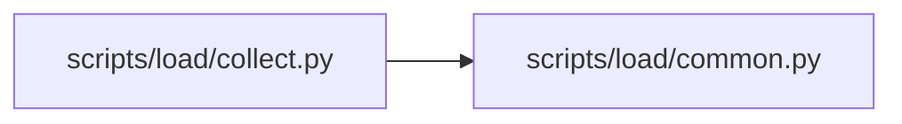

# collect Module

**Path:** `scripts/load/collect.py`

## Description

Collect sealed PostgreSQL evidence and derive qualification metrics.

## Imports

| Source | Symbols |
|--------|---------|
| `__future__` | `annotations` |
| `argparse` | `argparse` |
| `datetime` | `datetime`, `timedelta` |
| `decimal` | `Decimal` |
| `os` | `os` |
| `pathlib` | `Path` |
| `psycopg` | `psycopg` |
| `psycopg.rows` | `dict_row` |
| `scripts.load.common` | `DATA_LIFECYCLE_POLICY_MEMBER`, `QualificationInputError`, `atomic_write_json`, `capacity_contract`, `contract_member_sha256`, `contract_sha256`, `read_json_object`, `utc_now_text`, `verify_document` |
| `sqlalchemy.engine` | `make_url` |
| `sys` | `sys` |
| `typing` | `Any`, `Iterable`, `Mapping` |
| `uuid` | `uuid4` |

## Local dependency map

<!-- Auto-generated local dependency summary. Do not edit by hand. -->

### Internal neighbors

| Direction | Module |
|---|---|
| Outbound | [load_common](../modules/load_common.md) |

### External packages

| Language | Used packages | Undeclared packages |
|---|---:|---:|
| python | 2 | 2 |

## Functions

| Function | Signature | Decorators | Description |
|----------|-----------|------------|-------------|
| `_authorized_database_url` | `(args: argparse.Namespace) -> tuple[str, dict[str, Any]]` | — | — |
| `_one` | `(cursor: psycopg.Cursor[Any], query: str, params: Iterable[Any] = ()) -> dict[str, Any]` | — | — |
| `_int` | `(value: Any) -> int` | — | — |
| `_float` | `(value: Any) -> float` | — | — |
| `_json_safe` | `(value: Any) -> Any` | — | — |
| `_snapshot` | `(args: argparse.Namespace) -> int` | — | — |
| `_timestamp` | `(value: str) -> datetime` | — | — |
| `_table_map` | `(snapshot: Mapping[str, Any]) -> dict[str, Mapping[str, Any]]` | — | — |
| `_evidence_metrics` | `(paths: list[Path]) -> tuple[dict[str, float], list[dict[str, str]]]` | — | — |
| `_derive` | `(args: argparse.Namespace) -> int` | — | — |
| `_add_target_arguments` | `(parser: argparse.ArgumentParser) -> None` | — | — |
| `_parser` | `() -> argparse.ArgumentParser` | — | — |
| `main` | `() -> int` | — | — |
