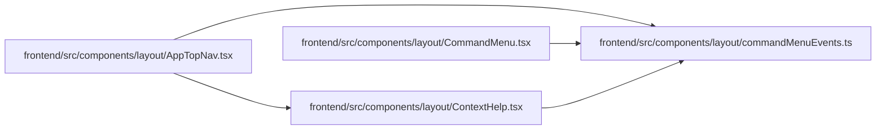

# commandMenuEvents Module

**Path:** `frontend/src/components/layout/commandMenuEvents.ts`

## Description

_Auto-generated from `frontend/src/components/layout/commandMenuEvents.ts`._

## Module Signals

| Signal | Values |
|--------|--------|
| Exports | `OPEN_COMMAND_MENU_EVENT`, `openCommandMenu` |
| Constants | `OPEN_COMMAND_MENU_EVENT` |

## Local dependency map

<!-- Auto-generated local dependency summary. Do not edit by hand. -->

### Internal neighbors

| Direction | Module |
|---|---|
| Inbound | [AppTopNav](../modules/AppTopNav.md) |
| Inbound | [CommandMenu](../modules/CommandMenu.md) |
| Inbound | [ContextHelp](../modules/ContextHelp.md) |

## Functions

| Function | Signature | Decorators | Description |
|----------|-----------|------------|-------------|
| `openCommandMenu` | `()` | — | — |
