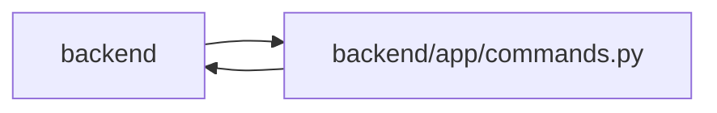

# commands Module

**Path:** `backend/app/commands.py`

## Description

Explicit transaction ownership shared by HTTP, MCP and service commands.

One command owns its transaction, original iteration/task revisions, and at most one pre-change snapshot per iteration. Apply commits at the owner; preview rolls back all database effects. Locks are acquired by sorted iteration ID before task context. Supplied stale revisions fail; missing versions remain an observed compatibility path. Planning-input edits reserve every affected scheduling aggregate.

Explicit command ownership keeps domain state, history, revisions and outbound intents atomic. Nested services flush; previews roll back. Iteration and project-backlog reservations serialize the relevant graph edits, and a command retains at most one recovery point per affected scope.

## Imports

| Source | Symbols |
|--------|---------|
| `app.authority` | `internal_authority`, `require_project`, `AuthorityError`, `internal_authority` |
| `app.models.iteration` | `Iteration`, `Iteration` |
| `app.models.project` | `Project` |
| `app.models.task` | `Task`, `Task` |
| `app.models.team_member` | `TeamMember`, `Vacation` |
| `app.runtime_telemetry` | `metrics` |
| `app.services.snapshot_service` | `SnapshotService` |
| `app.services.task_service` | `TaskService` |
| `contextlib` | `asynccontextmanager` |
| `dataclasses` | `dataclass`, `field` |
| `functools` | `wraps` |
| `inspect` | `python_inspect` |
| `sqlalchemy` | `select`, `update` |
| `sqlalchemy.ext.asyncio` | `AsyncSession` |
| `sqlalchemy.orm.attributes` | `set_committed_value` |
| `typing` | `Literal` |

## Local dependency map

<!-- Auto-generated local dependency summary. Do not edit by hand. -->

> Module-level dependencies exceed the generated-diagram limits, so the diagram and table below group them by top-level package. Counts report the number of module neighbors in each package.

### Internal neighbors

| Direction | Module |
|---|---|
| Inbound | `backend` (60) |
| Outbound | `backend` (8) |

### External packages

| Language | Used packages | Undeclared packages |
|---|---:|---:|
| python | 1 | 0 |

> All 66 module neighbor(s) are summarized by package because the module-level view exceeds the 12-node limit.

## Classes

| Class | Line | Bases | Description |
|-------|------|-------|-------------|
| [CommandState](../entities/CommandState.md) | 13 | — | — |
| [AggregateVersionConflict](../entities/AggregateVersionConflict.md) | 22 | `RuntimeError` | — |
| [HierarchyScopeError](../entities/HierarchyScopeError.md) | 33 | `RuntimeError` | — |

## Functions

| Function | Signature | Decorators | Description |
|----------|-----------|------------|-------------|
| `current_command` | `(db) -> CommandState \| None` | — | — |
| `commit_or_flush` | *(async)* `(db) -> None` | — | Collaborators flush under an owner; standalone legacy calls retain commit behavior. |
| `command_transaction` | *(async)* `(db: AsyncSession, *, mode = 'apply', commit = True)` | `@asynccontextmanager` | — |
| `atomic_command` | `(function)` | — | Give standalone service commands an owner without committing inside another command. |
| `preview_command` | `(function)` | — | Give a calculation a rollback boundary in every transport and direct invocation. |
| `lock_backlog_project` | *(async)* `(db, project_id)` | — | Serialize unscheduled hierarchy writes without manufacturing an iteration. |
| `lock_iterations` | *(async)* `(db: AsyncSession, iteration_ids, *, expected = None) -> dict[int, int]` | — | Acquire aggregate locks in ascending ID order, then task locks in ascending ID order. |
| `schedule_input_command` | `(kind)` | — | Capture and revise every affected iteration before editing shared planning inputs. |