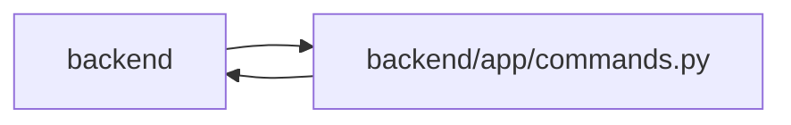

# commands Module

**Path:** `backend/app/commands.py`

## Description

Aggregate reservations can require complete observed revisions for structural and shared-input commands. A bounded transport revision map is merged with body revisions only when values agree; protected iteration reservations are remembered within the command. Transport context and command observations are cleared at the owning transaction boundary.

Owns apply and rollback-only transactions. Shared planning reserves the workspace coordinator before project, iteration and task locks; iterations and tasks are acquired in ascending ID order. Each command reserves one version per affected task. Before commit, delivery changes invalidate downstream evidence and notification intents join the same transaction. Failures and previews roll back snapshots, history, revisions and outbox rows together.

## Imports

| Source | Symbols |
|--------|---------|
| `app.authority` | `internal_authority`, `internal_authority`, `require_project`, `AuthorityError`, `internal_authority` |
| `app.models.capacity` | `PlanningState`, `ProfileAvailability` |
| `app.models.iteration` | `Iteration`, `Iteration` |
| `app.models.project` | `Project` |
| `app.models.task` | `Task`, `Task` |
| `app.models.team_member` | `TeamMember`, `Vacation` |
| `app.mutation_versions` | `require_mutation_revision` |
| `app.runtime_telemetry` | `metrics` |
| `app.services.delivery_dependency_service` | `DeliveryDependencyService` |
| `app.services.discussion_service` | `DiscussionService` |
| `app.services.snapshot_service` | `SnapshotService` |
| `app.services.task_service` | `TaskService` |
| `contextlib` | `asynccontextmanager` |
| `dataclasses` | `dataclass`, `field` |
| `functools` | `wraps` |
| `inspect` | `python_inspect` |
| `sqlalchemy` | `select`, `update` |
| `sqlalchemy.dialects.postgresql` | `insert` |
| `sqlalchemy.dialects.sqlite` | `insert` |
| `sqlalchemy.ext.asyncio` | `AsyncSession` |
| `sqlalchemy.orm.attributes` | `set_committed_value` |
| `typing` | `Literal` |

## Local dependency map

<!-- Auto-generated local dependency summary. Do not edit by hand. -->

> Module-level dependencies exceed the generated-diagram limits, so the diagram and table below group them by top-level package. Counts report the number of module neighbors in each package.

### Internal neighbors

| Direction | Module |
|---|---|
| Inbound | `backend` (74) |
| Outbound | `backend` (12) |

### External packages

| Language | Used packages | Undeclared packages |
|---|---:|---:|
| python | 1 | 0 |

> All 82 module neighbor(s) are summarized by package because the module-level view exceeds the 12-node limit.

## Classes

| Class | Line | Bases | Description |
|-------|------|-------|-------------|
| [CommandState](../entities/CommandState.md) | 13 | — | — |
| [AggregateVersionConflict](../entities/AggregateVersionConflict.md) | 25 | `RuntimeError` | — |
| [HierarchyScopeError](../entities/HierarchyScopeError.md) | 36 | `RuntimeError` | — |
| [PlanningConflict](../entities/PlanningConflict.md) | 41 | `RuntimeError` | — |

## Functions

| Function | Signature | Decorators | Description |
|----------|-----------|------------|-------------|
| `lock_planning` | *(async)* `(db, *, expected = None)` | — | Reserve shared planning before narrower locks, once per command including previews. |
| `current_command` | `(db) -> CommandState \| None` | — | — |
| `commit_or_flush` | *(async)* `(db) -> None` | — | Collaborators flush under an owner; standalone legacy calls retain commit behavior. |
| `command_transaction` | *(async)* `(db: AsyncSession, *, mode = 'apply', commit = True)` | `@asynccontextmanager` | — |
| `atomic_command` | `(function)` | — | Give standalone service commands an owner without committing inside another command. |
| `preview_command` | `(function)` | — | Give a calculation a rollback boundary in every transport and direct invocation. |
| `lock_backlog_project` | *(async)* `(db, project_id)` | — | Serialize unscheduled hierarchy writes without manufacturing an iteration. |
| `lock_iterations` | *(async)* `(db: AsyncSession, iteration_ids, *, expected = None, require_expected = False, revision_field = 'expected_revisions') -> dict[int, int]` | — | Acquire aggregate locks in ascending ID order, then task locks in ascending ID order. |
| `schedule_input_command` | `(kind)` | — | Capture and revise every affected iteration before editing shared planning inputs. |