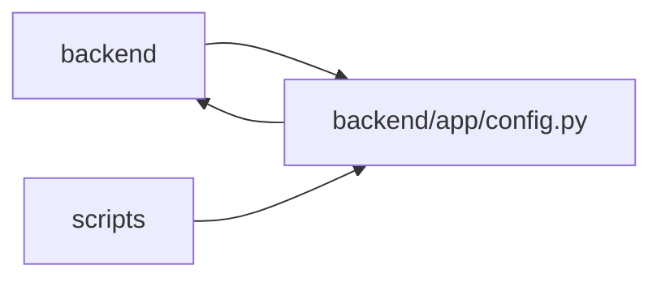

# config Module

**Path:** `backend/app/config.py`

## Description

_Auto-generated from `backend/app/config.py`._

## Imports

| Source | Symbols |
|--------|---------|
| `app.database_config` | `parse_database_configuration` |
| `functools` | `lru_cache` |
| `ipaddress` | `ip_network` |
| `pydantic` | `field_validator`, `model_validator` |
| `pydantic_settings` | `BaseSettings`, `SettingsConfigDict` |
| `re` | `re` |
| `typing` | `Any`, `Literal` |

## Local dependency map

<!-- Auto-generated local dependency summary. Do not edit by hand. -->

> Module-level dependencies exceed the generated-diagram limits, so the diagram and table below group them by top-level package. Counts report the number of module neighbors in each package.

### Internal neighbors

| Direction | Module |
|---|---|
| Inbound | `backend` (53) |
| Inbound | `scripts` (1) |
| Outbound | `backend` (1) |

### External packages

| Language | Used packages | Undeclared packages |
|---|---:|---:|
| python | 2 | 0 |

> All 55 module neighbor(s) are summarized by package because the module-level view exceeds the 12-node limit.

## Classes

| Class | Line | Bases | Description |
|-------|------|-------|-------------|
| [Settings](../entities/Settings.md) | 12 | `BaseSettings` | Application settings. |

## Functions

| Function | Signature | Decorators | Description |
|----------|-----------|------------|-------------|
| `get_settings` | `() -> Settings` | `@lru_cache` | Get cached settings instance. |
